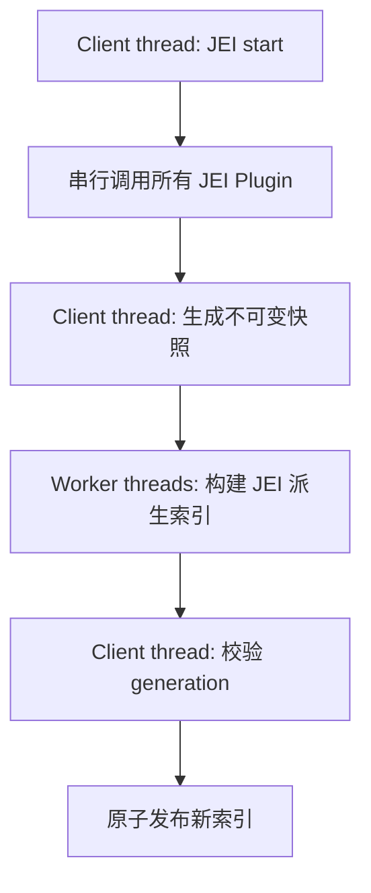

# JEI Mixin Optimization Plan

本文档面向 JEI 1.20.1 分支，目标是在大型整合包中降低“进入世界后 JEI 初始化卡顿”，并且满足以下硬约束：

1. 不修改任何其他模组的 JEI Plugin。
2. 不破坏 JEI 原有功能，默认行为必须保持等价。
3. 只通过 Mixin、辅助类、配置和单次启动内缓存层改 JEI 本体行为。
4. 不默认跳过插件、不默认关闭搜索功能、不默认限制 recipe 数量。

核心原则：不要并行执行其他插件代码。应当先在 Minecraft client thread 上串行调用 JEI Plugin，得到完整结果或稳定快照；然后只把 JEI 自己的派生计算放到后台线程，例如搜索索引、排序索引、recipe UID map、短生命周期缓存填充。

本文不设计本地跨世界缓存或持久化磁盘缓存。所有缓存默认只在一次 `JeiStarter.start()` 到 `JeiStarter.stop()` 的生命周期内有效，退出世界、切换服务器、资源/数据包 reload 后必须丢弃。

## 相关源码入口

- JEI 启动入口：`Library/src/main/java/mezz/jei/library/startup/JeiStarter.java`
- 插件阶段调用：`Library/src/main/java/mezz/jei/library/load/PluginCaller.java`
- 插件加载阶段：`Library/src/main/java/mezz/jei/library/load/PluginLoader.java`
- GUI 启动：`Gui/src/main/java/mezz/jei/gui/startup/JeiGuiStarter.java`
- ingredient filter：`Gui/src/main/java/mezz/jei/gui/ingredients/IngredientFilter.java`
- 搜索索引：`Gui/src/main/java/mezz/jei/gui/search/ElementSearch.java`
- 搜索 prefix：`Gui/src/main/java/mezz/jei/gui/search/ElementPrefixParser.java`
- ingredient 列表元素：`Gui/src/main/java/mezz/jei/gui/ingredients/ListElementInfo.java`
- ingredient 排序：`Gui/src/main/java/mezz/jei/gui/ingredients/IngredientSorter.java`
- recipe registry：`Library/src/main/java/mezz/jei/library/recipes/RecipeManagerInternal.java`
- recipe map：`Library/src/main/java/mezz/jei/library/recipes/collect/RecipeMap.java`
- recipe supplier 构建：`Library/src/main/java/mezz/jei/library/util/IngredientSupplierHelper.java`
- Forge 生命周期：`Forge/src/main/java/mezz/jei/forge/startup/StartEventObserver.java`
- Fabric 生命周期：`Fabric/src/main/java/mezz/jei/fabric/startup/ClientLifecycleHandler.java`

## 不可采用的方案

这些方案虽然可能更快，但不满足“不破坏功能”的约束，不能作为默认优化：

1. 并行调用所有 `IModPlugin` 回调。
2. 在后台线程调用其他模组的 `registerRecipes`、`registerIngredients`、`registerRuntime`。
3. 在后台线程直接调用 `IRecipeCategory.setRecipe`。
4. 在后台线程直接调用 ingredient renderer tooltip。
5. 跳过某个插件。
6. 关闭 alias、tooltip、tag、resource location、creative tab 搜索。
7. 限制 recipe 数量。
8. 黑名单 recipe type。
9. 不注册 catalysts。
10. 只构建 INPUT/OUTPUT 索引，丢弃 CATALYST 或 RENDER_ONLY。

这些可以作为显式的调试选项或用户自担风险选项，但不能默认启用，也不属于本文的“功能等价优化”。

## 线程模型

推荐线程模型如下：



后台线程只能处理以下对象：

- `String`
- primitive value
- `ResourceLocation` 字符串化结果
- ingredient UID
- recipe UID
- immutable list/map/set snapshot
- JEI 自己的中间 DTO

后台线程不应直接处理以下对象：

- `IModPlugin`
- `IRecipeCategory`
- `IIngredientHelper`
- `IIngredientRenderer`
- `Minecraft`、`ClientLevel`、`Screen`
- JEI registration 对象
- 可变 `ItemStack` 原对象，除非先生成稳定 key

每次 `JeiStarter.start()` 分配一个 `generationId`。所有后台任务都携带这个 id。任务完成后回到 client thread，如果当前 generation 不一致，直接丢弃结果，避免退出世界或换服后的旧结果污染新 runtime。

## 通用 Mixin 辅助设施

### 1. Generation 管理

新增辅助类，例如：

```java
public final class JeiOptimizationRuntimeState {
    private static final AtomicLong GENERATION = new AtomicLong();
    private static volatile long currentGeneration;

    public static long beginStart() {
        currentGeneration = GENERATION.incrementAndGet();
        return currentGeneration;
    }

    public static long currentGeneration() {
        return currentGeneration;
    }

    public static boolean isCurrent(long generation) {
        return currentGeneration == generation;
    }

    public static void invalidate() {
        currentGeneration = GENERATION.incrementAndGet();
    }
}
```

Mixin target：

- `JeiStarter.start()` HEAD：调用 `beginStart()`。
- `JeiStarter.stop()` HEAD：调用 `invalidate()` 并取消后台任务。

### 2. Client thread 发布工具

新增辅助类：

```java
public final class JeiMainThreadExecutor {
    public static void execute(Runnable runnable) {
        Minecraft minecraft = Minecraft.getInstance();
        if (minecraft.isSameThread()) {
            runnable.run();
        } else {
            minecraft.execute(runnable);
        }
    }
}
```

后台任务不能直接修改 JEI runtime，只能通过该工具回到 client thread。

### 3. 后台 executor

建议使用固定大小线程池，不要无限创建线程：

```java
int workers = Math.max(1, Math.min(4, Runtime.getRuntime().availableProcessors() / 2));
ExecutorService JEI_OPT_EXECUTOR = Executors.newFixedThreadPool(workers, threadFactory);
```

退出游戏或资源 unload 时关闭线程池，或使用 daemon thread。

### 4. 快照对象

示例 DTO：

```java
record IngredientSearchSnapshot(
    Object uid,
    List<String> names,
    List<String> modNames,
    List<String> modIds,
    List<String> tooltipStrings,
    List<String> tagStrings,
    List<String> creativeTabStrings,
    List<String> colorStrings,
    String resourceLocation,
    boolean visible,
    int createdIndex
) {}
```

快照构建必须在 client thread 完成。后台只用快照建索引。

## 方案 A：诊断与观测

### A1. 增强插件阶段计时

目标：不改变行为，只知道慢在哪里。

Mixin target：`PluginCaller.callOnPlugins(String title, List<IModPlugin> plugins, Consumer<IModPlugin> func)`。

实现方法：

1. 在循环开始前记录 `title`。
2. 每个 plugin 调用前记录 `plugin.getPluginUid()` 和 `System.nanoTime()`。
3. 调用结束后记录耗时。
4. 将结果写入一个本次启动的 `PluginStageTimingCollector`。
5. `JeiStarter.start()` RETURN 时输出 Top N。

注意事项：

- 不要吞异常；保持 JEI 原本的异常处理逻辑。
- 不改变调用顺序。
- 不额外调用 plugin 回调，只记录已有调用。

验证：

- 日志中应出现每个阶段总耗时。
- 对游戏行为没有影响。

### A2. 统计注册数量

目标：找出“慢且注册量巨大”的插件。

Mixin target：

- `IngredientManagerBuilder.register`
- `IngredientManagerBuilder.addExtraIngredients`
- `IngredientManagerBuilder.addAlias`
- `IngredientManagerBuilder.addAliases`
- `RecipeRegistration.addRecipes`
- `RecipeCategoryRegistration.addRecipeCategories`
- `RecipeCatalystRegistration.addRecipeCatalyst(s)`

实现方法：

1. 在 `PluginCaller` 开始调用某个 plugin 前，把当前 plugin uid 放入 `ThreadLocal<ResourceLocation>`。
2. 在 registration 方法中读取 ThreadLocal。
3. 累加该 plugin 在该阶段注册的数量。
4. plugin 调用结束后清空 ThreadLocal。

示例：

```java
public final class JeiPluginCallContext {
    private static final ThreadLocal<ResourceLocation> CURRENT_PLUGIN = new ThreadLocal<>();
    public static void set(ResourceLocation uid) { CURRENT_PLUGIN.set(uid); }
    public static Optional<ResourceLocation> get() { return Optional.ofNullable(CURRENT_PLUGIN.get()); }
    public static void clear() { CURRENT_PLUGIN.remove(); }
}
```

注意事项：

- 目前 plugin 调用仍在 client thread 串行执行，ThreadLocal 足够安全。
- 如果未来并行调用 plugin，ThreadLocal 仍可用，但 registration 对象线程安全是另一件事；本文不建议并行 plugin。

验证：

- 日志中看到 plugin uid、recipes 数、aliases 数。
- 数量统计不应改变 JEI 展示。

### A3. JFR / profiler marker

目标：让 profiler 能看到 JEI 各阶段。

Mixin target：

- `JeiStarter.start()`
- `PluginLoader.registerSubtypes`
- `PluginLoader.registerIngredients`
- `PluginLoader.createRecipeManager`
- `JeiGuiStarter.start`
- `IngredientFilter` constructor
- `RecipeManagerInternal.addRecipes`

实现方法：

1. 在每个阶段 HEAD/RETURN 放入 marker。
2. 如果使用 JFR，自定义 `Event` 类。
3. 如果使用 Minecraft profiler，可用 profiler push/pop，但要避免版本耦合。

验证：

- JFR 中能看到 JEI 阶段区间。
- 不影响逻辑。

## 方案 B：低风险单线程优化

### B1. IngredientFilter 构造期批量 add

现状：`IngredientFilter` 构造函数中循环调用 `addIngredient`，每个 ingredient 都会 `invalidateCache()`。

目标源码：`IngredientFilter` constructor 和 `ElementSearch.addAll`。

实现方法：

1. Mixin 到 `IngredientFilter` 构造函数。
2. 用 `@Redirect` 或 `@ModifyArg` 避免逐个调用 `addIngredient`。
3. 对所有 `IListElementInfo` 先执行 hidden state 初始化。
4. 调用 `elementSearch.addAll(ingredients, ingredientManager)`。
5. 最后只调用一次 `invalidateCache()`。

伪代码：

```java
for (IListElementInfo<?> info : ingredients) {
    IListElement<?> element = info.getElement();
    updateHiddenStateInvoker(element);
}
elementSearch.addAll(ingredients, ingredientManager);
invalidateCache();
```

Mixin 需求：

- `@Accessor` 访问 `elementSearch`。
- `@Invoker` 调用 private `updateHiddenState`，或复制等价逻辑。
- 若构造函数 redirect 过难，可以 `@Overwrite` 构造逻辑，但风险更高。

功能等价性：

- 搜索索引内容一致。
- hidden state 一致。
- 初始化阶段没有外部 listener 依赖每个 ingredient 的中间 cache invalidation。

验证：

- 进入世界后 ingredient 数量一致。
- 空搜索列表顺序一致。
- 搜索 display name、mod name、tooltip、tag 结果一致。

### B2. 预分配集合容量

目标源码：

- `IngredientListElementFactory.createBaseList`
- `RecipeManagerInternal.addRecipes`
- `RecipeMap`
- `IngredientToRecipesMap`
- `ElementSearch`

实现方法：

1. 在能获得输入 size 的地方替换 `new ArrayList<>()` 为 `new ArrayList<>(expectedSize)`。
2. 对 `Object2ObjectOpenHashMap` 设置 expected size。
3. 对临时 `HashSet` 使用预估容量。

可行注入点：

- 使用 `@Redirect` 替换构造调用。
- 或在目标类构造后扩容 fastutil map。

功能等价性：只改变容量，不改变内容和顺序。

验证：

- 查询结果一致。
- profiler 中 rehash / allocation 下降。

### B3. 启动期局部 UID 缓存

热点：`IIngredientHelper.getUniqueId` 在 ingredient search、recipe map、alias 中重复调用。

目标源码：

- `RecipeMap.getIngredientUid`
- `ElementSearch.getUid`
- `IngredientInfo.getIngredientAliases`
- `IngredientInfo.addIngredientAlias(es)`

实现方法：

1. 新增 `JeiUidCache`，生命周期为一次 JEI start。
2. key 包含 `IIngredientType`、`UidContext`、稳定 ingredient key。
3. 对 `ItemStack` 不建议直接长期以对象作为 key；可使用短生命周期 identity cache，或先构建稳定 key。
4. 在 `JeiStarter.stop()` 清空。

推荐两层缓存：

- 短期 identity cache：只在一次 start 内有效，`IdentityHashMap<Object, String>`。
- 稳定 key cache：只对明确不可变或已规范化的值使用。

Mixin target：

- `RecipeMap#getIngredientUid` 使用 `@Redirect` 包装 `ingredientHelper.getUniqueId`。
- `ElementSearch#getUid` 同理。
- `IngredientInfo` alias 方法同理。

注意事项：

- `ItemStack` 可变，不要跨 world 持久缓存原对象。
- 不要改变 `UidContext.Ingredient` 与 `UidContext.Recipe` 的语义。

验证：

- 同一 ingredient 的 recipe lookup 结果一致。
- NBT subtype 搜索一致。
- 退出世界再进世界不复用旧 cache。

### B4. ListElementInfo 派生字符串缓存

目标源码：`ListElementInfo`。

可缓存内容：

- display name lowercase
- mod ids
- mod names
- aliases 翻译结果
- tooltip strings
- tag strings
- creative tab strings
- resource location string

实现方法：

1. 构造 `ListElementInfo` 时，先查本次启动 cache。
2. 未命中时按原逻辑计算。
3. 写入 cache。
4. 本次 start 内缓存 key 至少包含 ingredient UID、ingredient type、语言、tooltip flag、搜索配置相关项。

Mixin target：

- `ListElementInfo` constructor 可用 `@Inject` + `@Redirect` 包装关键调用。
- `getTooltipStrings`
- `getTagStrings`
- `getCreativeTabsStrings`

注意事项：

- tooltip 可能受 advanced tooltip、语言、资源包影响。
- creative tab 可能受 enabled features 和权限影响。
- tag 受服务端数据包影响。

只做“一次 start 内缓存”，不做跨 world 持久化或磁盘落地。

验证：

- 搜索结果一致。
- 切换语言后重建结果正确。
- 不同服务器 feature flags 下不串缓存。

### B5. IngredientSorter sort key 预计算

目标源码：`IngredientSorter.sortIngredients` 和 `IngredientSorterComparators`。

问题：Comparator 在排序过程中会多次读取 names、mod name、tag、armor、durability 等信息。

实现方法：

1. 在排序前为每个 `IListElementInfo` 生成 `SortKey`。
2. `SortKey` 按配置包含各排序阶段字段。
3. 排序 `List<SortableElement>`。
4. 排序后按排序结果设置 `element.setSortedIndex(i)`。

示例：

```java
record SortableElement(IListElementInfo<?> info, JeiIngredientSortKey key) {}
record JeiIngredientSortKey(
    String modNameKey,
    String ingredientTypeKey,
    int creativeIndex,
    String tagKey,
    boolean isArmor,
    int armorSlot,
    int armorDefense,
    float armorToughness,
    int maxDurability,
    String alphabetical
) {}
```

Mixin target：

- `IngredientSorter.sortIngredients` 可 `@Inject(cancellable = true)` 替换整段方法。

功能等价性：

- 只要 SortKey 比较顺序与原 comparator 一致，结果等价。

验证：

- 同一配置下 ingredient 顺序与原版一致。
- 包含 TAG、ARMOR、MAX_DURABILITY 排序阶段时结果一致。

### B6. tag count 缓存

目标源码：`IngredientSorterComparators.tagCount`。

实现方法：

1. 按 `ResourceLocation tagId` 缓存 tag size。
2. 一次 start 内有效。
3. reload 或 stop 清空。

Mixin target：

- `@Inject(method = "tagCount", at = @At("HEAD"), cancellable = true)`。

验证：

- TAG 排序结果一致。

### B7. compact 延后

目标源码：`RecipeManagerInternal.compact`、`RecipeMap.compact`、`IngredientToRecipesMap.compact`。

问题：`trimToSize` 降内存但会占启动期时间。

实现方法：

1. Mixin `RecipeManagerInternal.compact()`，不立即执行。
2. 将 compact 任务放入 client thread 延迟队列，或后台对已不再写入的结构执行。
3. 如果后台执行，必须确认结构不会被同时写入。

推荐实现：

- start 完成后延迟 5 到 10 秒。
- 或在第一次打开 JEI 后空闲 tick 执行。

功能等价性：

- compact 只影响内存占用，不影响查询结果。

验证：

- recipe 查询一致。
- 启动期耗时下降。
- 稍后内存回落。

## 方案 C：多线程但不碰插件代码

### C1. 搜索索引后台构建

目标源码：`IngredientFilter`、`ElementSearch`、`ElementPrefixParser`。

实现方法：

1. Client thread 构建 `IngredientSearchSnapshot` 列表。
2. 后台线程根据快照构建新的搜索 storage。
3. 构建完成后回到 client thread。
4. 检查 generation 是否仍然有效。
5. 原子替换 `IngredientFilter.elementSearch`。
6. `invalidateCache()` 并通知 listeners。

关键点：

- 后台线程不能调用 `IIngredientHelper`、`IIngredientRenderer`、`IListElementInfo.getTooltipStrings`。
- 所有字符串必须提前在 client thread 生成。

实现方式：

- 新建 `SnapshotElementSearch implements IElementSearch`。
- 它不直接持有 `IListElementInfo`，而是持有 `IngredientSearchSnapshot` 和 `IListElement` 映射。
- 原 `ElementSearch` 仍可作为 fallback。

发布伪代码：

```java
long generation = JeiOptimizationRuntimeState.currentGeneration();
List<IngredientSearchSnapshot> snapshots = createSnapshotsOnClientThread(...);

CompletableFuture
    .supplyAsync(() -> SnapshotElementSearch.build(snapshots), JEI_OPT_EXECUTOR)
    .thenAccept(search -> JeiMainThreadExecutor.execute(() -> {
        if (!JeiOptimizationRuntimeState.isCurrent(generation)) {
            return;
        }
        ingredientFilterAccessor.setElementSearch(search);
        ingredientFilter.invalidateCache();
        ingredientFilterInvoker.notifyListenersOfChange();
    }));
```

功能等价性：

- 搜索结果必须与原 `ElementSearch` 一致。
- 构建完成前可继续使用旧索引或同步初始索引。

验证：

- 空搜索结果一致。
- 所有 prefix 搜索一致。
- 退出世界时后台任务不会发布。

### C2. tooltip/tag/creative tab 快照，后台建索引

目标：保持功能完整，同时避免 suffix tree / storage 构建阻塞 client thread。

实现方法：

1. Client thread 遍历 `IListElementInfo`。
2. 对每个元素调用原始方法提取字符串：names、tooltip、tag、creative tab、color、resource location。
3. 存入不可变 DTO。
4. 后台线程只做字符串索引构建。

注意事项：

- 这不能减少字符串提取成本，只能减少索引构建阻塞。
- 如果 tooltip 字符串提取本身最慢，需要结合 B4 的缓存。

验证：

- 搜索结果一致。

### C3. ingredient 排序后台执行

目标源码：`IngredientSorter.sortIngredients`。

实现方法：

1. Client thread 生成 `SortableElement` 快照。
2. 后台线程排序快照。
3. Client thread 写回 sortedIndex。

注意事项：

- `IListElement.setSortedIndex` 必须回 client thread。
- 如果排序结果尚未完成，JEI 可以临时使用 created index 顺序，但这会造成短暂顺序变化。若要求严格启动完成即完全一致，则等待后台排序完成后再发布 runtime。

功能等价策略：

- 保守方案：后台排序完成前不发布最终 filter。
- 体验优先方案：先发布临时顺序，完成后刷新；这不丢功能，但视觉顺序会变化。

建议在“不破坏功能”严格模式下使用保守方案。

### C4. recipe UID 快照后后台建 map

目标源码：`RecipeManagerInternal.addRecipes`、`RecipeMap`、`IngredientToRecipesMap`。

实现方法：

1. Client thread 保持原顺序调用插件 `registerRecipes`。
2. `RecipeRegistration.addRecipes` 不直接写最终 `RecipeMap`，而是进入中间 buffer。
3. Client thread 对每条 recipe 执行原本必须在主线程上的逻辑：
   - `recipeCategory.isHandled(recipe)`
   - `IngredientSupplierHelper.getIngredientSupplier(recipe, recipeCategory, ingredientManager)`
   - `ingredientHelper.getUniqueId(..., UidContext.Recipe)`
4. 得到 `RecipeIndexSnapshot`：

```java
record RecipeIndexSnapshot<T>(
    RecipeType<T> recipeType,
    T recipe,
    Map<RecipeIngredientRole, Set<Object>> roleToIngredientUids,
    boolean hidden
) {}
```

5. 后台线程按 role 和 recipe type 构建 `uid -> recipes` map。
6. Client thread 发布到 JEI 内部结构。

实现难点：

- 原 JEI 的 `RecipeManagerInternal` 和 `RecipeMap` 没有现成的“替换完整 map”API。
- 可能需要 Mixin `@Accessor` 写入字段，或复制实现一个兼容的 optimized map。
- 要保持 `PluginManager` 与 `InternalRecipeManagerPlugin` 查询行为一致。

功能等价性：

- 快照生成阶段仍使用原 JEI category/helper 逻辑。
- 后台只改变 map 构建线程，不改变内容。

验证：

- 每个 recipe type 总数量一致。
- 对每个 ingredient 的 R/U 查询结果一致。
- catalyst 查询一致。
- hidden recipe/category 行为一致。

### C5. 按 recipe type 并行构建内部索引

目标：降低 C4 的实现复杂度。

实现方法：

1. 不改变 `RecipeRegistration.addRecipes` 的输入行为。
2. 在 `RecipeManagerInternal.addRecipes` 内按 recipe type 拆分任务。
3. 对每个 recipe type 构建临时 map。
4. client thread 合并到最终结构。

注意事项：

- 如果仍在后台调用 `setRecipe`，不安全。
- 正确做法仍是主线程生成 `RecipeIndexSnapshot`，后台只建 map。

### C6. 后台预热调度

目标：避免“懒加载只是把卡顿挪到第一次使用”。进入世界后，在功能可用的同时立即启动后台构建，让重索引尽量在用户第一次搜索或按 R/U 之前完成。

实现方法：

1. `JeiStarter.start()` 完成插件回调与主线程快照后，创建本次 start 的 `generationId`。
2. 按优先级提交后台任务：名称/模组名搜索索引、tooltip/tag 搜索索引、排序结果、recipe focus index、catalyst index。
3. 每个任务只读取不可变快照，只生成新的只读 index。
4. 任务完成后回到 client thread，检查 generation，仍有效才发布。
5. 如果用户在任务完成前触发对应功能，走“首次请求兜底策略”（见方案 D），而不是返回错误或不完整结果。

优先级建议：

1. 空搜索和名称搜索。
2. `@mod` 搜索。
3. R/U 常用 recipe focus index。
4. tooltip/tag/resource location/creative tab/color 搜索。
5. catalyst 与书签预览等低频路径。

功能等价性：

- 后台预热不跳过任何索引。
- 索引未就绪时必须有同步兜底或等待策略，不能返回不完整结果。
- 不写入本地磁盘缓存，退出世界后所有任务和缓存都失效。

## 方案 D：异步懒加载与后台预热

普通懒加载如果在“第一次搜索 / 第一次按 R/U / 第一次打开 GUI”时同步构建索引，本质只是把进入世界卡顿转移到第一次交互。本文推荐的懒加载必须满足两点：后台提前构建；首次请求如果撞上未完成状态，有明确兜底，不返回不完整结果。

### D0. 懒加载状态机

每个可异步构建的索引维护状态：

```java
enum AsyncIndexState {
    NOT_STARTED,
    SNAPSHOTTING,
    BUILDING,
    READY,
    FAILED
}
```

通用流程：

1. Client thread 创建不可变快照，状态从 `NOT_STARTED` 到 `SNAPSHOTTING`。
2. 快照完成后立即提交 worker，状态变为 `BUILDING`。
3. Worker 只处理快照，构建只读 index。
4. Client thread 校验 generation 后发布，状态变为 `READY`。
5. 失败时状态变为 `FAILED`，回退原同步路径并记录日志。

首次请求兜底策略：

- `READY`：直接查询新 index。
- `BUILDING`：如果同步 API 必须立即返回完整结果，则等待该 future 完成；这仍可能阻塞，但只发生在用户抢先使用时。
- `BUILDING`：如果当前路径允许短暂 UI 提示，则显示“索引构建中”并在完成后刷新；仅适用于不会破坏 API 语义的 GUI 层。
- `FAILED`：走原版同步实现，保证功能不丢。

### D1. 搜索 prefix 索引后台预热

目标源码：`ElementPrefixParser`、`ElementSearch`。

实现方法：

1. 启动时主线程创建 `IngredientSearchSnapshot`，包含 names、mod names、tooltip strings、tag strings、creative tab strings、color strings、resource location。
2. 对每个 prefix 创建 `AsyncSearchIndex`。
3. 进入世界后立即提交后台任务构建 `@`、`#`、`$`、`%`、`^`、`&` 的 storage。
4. `getSearchResults` 查询时，如果对应 prefix 已 `READY`，直接查询。
5. 如果仍在 `BUILDING`，同步搜索 API 可以等待 future，GUI 层也可以选择保留上一轮结果并在 index ready 后刷新。
6. 如果构建失败，回退到原 `ElementSearch` 的同步构建或线性扫描快照。

关键点：

- 真正挪到 worker 的是 suffix tree / limited string storage 构建。
- tooltip/tag/creative tab 字符串是否能在 worker 提取，取决于是否会调用 plugin/helper/renderer。默认不在 worker 提取这些字符串，只在 worker 建索引。
- 为避免首次 `#tooltip` 搜索卡顿，应该在进入世界后立即后台预热 `#`，而不是等用户输入 `#` 才启动。

### D2. 主线程分片快照 + Worker 建索引

目标：处理 tooltip/tag/creative tab 字符串提取仍然很慢的问题。

做法不是把不安全的 renderer/helper 调到 worker，而是把主线程快照提取切片，然后每片交给 worker 建索引：

1. 维护一个 client tick 任务队列，每 tick 只处理固定预算，例如 1 到 3 ms。
2. 每次处理一批 `IListElementInfo`，提取 tooltip/tag/creative tab 字符串并生成快照 chunk。
3. 每个 chunk 立即提交 worker，worker 增量写入 builder。
4. 所有 chunk 完成后，client thread 发布完整 index。

收益：主线程仍承担不安全 API 调用，但不会长时间连续阻塞；纯索引构建真实移动到 worker。

功能等价性：

- 完整 index 发布前不能返回不完整搜索结果。
- 如果用户提前搜索相关 prefix，可等待该 prefix 的 future 或走原同步路径。

### D3. recipe focus index 后台预热

目标源码：`InternalRecipeManagerPlugin.getRecipeTypes`、`InternalRecipeManagerPlugin.getRecipes(recipeCategory, focus)`。

实现方法：

1. 启动期保留完整 recipe list。
2. 主线程生成 recipe index snapshot：recipe type、recipe identity/id、role -> ingredient UID set。
3. Worker 按 recipe type 构建 input/output/catalyst/render-only 反查 map。
4. 进入世界后立即后台预热常用 recipe type，而不是等第一次 R/U。
5. 第一次 R/U 如果索引未就绪，等待对应 recipe type 的 future；或用完整 recipe list 做一次原版同步 fallback。

限制：

- `IRecipeCategory.setRecipe` 和 `IIngredientHelper.getUniqueId` 默认仍在主线程生成快照。
- Worker 只构建 `uid -> recipes` map。

### D4. catalyst index 后台预热

目标源码：`RecipeMap.addCatalystForCategory`、`RecipeMap.isCatalystForRecipeCategory`。

实现方法：

1. 主线程记录 recipe type -> catalysts 的 typed ingredient UID 快照。
2. Worker 构建 catalyst UID -> recipe type map。
3. 进入世界后立即预热。
4. 用户提前点击 catalyst 时，等待 future 或走原同步 map。

功能等价性：查询结果一致，不跳过任何 catalyst。

### D5. GUI 与书签的异步边界

目标源码：`JeiGuiStarter.start` 中 `RecipesGui`、`BookmarkList`、`bookmarkConfig.loadBookmarks`。

原则：GUI 对象本身仍在 client thread 创建；只能把可快照的数据准备和纯计算移到 worker。

实现方法：

1. 书签文件读取和 registry-sensitive 解析保留在 client thread。
2. 书签 preview 的字符串、排序、recipe lookup 辅助结构可用快照交给 worker 预热。
3. `RecipesGui` 可使用 proxy，但 proxy 第一次被调用时不能在 worker 创建真实 GUI；只能等待或触发 client thread 创建。
4. 对用户可见的首次打开卡顿，优先用后台预热而不是首次同步构建。

风险：中等。书签涉及持久化与 registry access，必须保证老书签兼容。

## 方案 E：单次启动内短生命周期缓存

### E1. 一次启动内短生命周期缓存

适合缓存：

- ingredient UID
- recipe UID
- display name lowercase
- tag strings
- creative tab strings
- tooltip strings
- sort key

实现方法：

1. `JeiStarter.start()` HEAD 创建 cache scope。
2. 各 Mixin 从 scope 获取 cache。
3. `JeiStarter.stop()` 清空。

优点：最安全，不需要复杂 cache key。

缺点：只能优化一次 start 内重复计算，不尝试加速下一次进世界。

### E2. 禁止本地跨世界缓存

本文明确不设计以下内容：

- 搜索文本磁盘缓存。
- recipe UID 索引磁盘缓存。
- prefix index 序列化缓存。
- 按服务器、数据包、资源包、语言、mod list 组合出的本地持久缓存。

原因：这些缓存的失效条件复杂，容易在切换服务器、数据包、语言、资源包、feature flags 或插件动态 recipe 行为时产生错误结果。当前优化目标优先保证功能等价和可验证性。

### E3. 只缓存 JEI 派生结果，不缓存插件对象

禁止缓存：

- `IModPlugin` 实例
- `IRecipeCategory` 实例
- recipe object 本体
- renderer/helper 对象
- screen handler 对象

允许缓存：

- strings
- UID
- primitive sort key
- 本次 start 内 recipe object 到 UID set 的映射
- 本次 start 内 prefix index builder 中间结果

生命周期：

- `JeiStarter.start()` 创建。
- resource reload 或 JEI restart 时丢弃。
- `JeiStarter.stop()` 必须清空。

## 方案 F：Reload / Restart 合并

### F1. Forge restart debounce

目标源码：`StartEventObserver.restart()`。

实现方法：

1. Mixin `restart()`。
2. 如果短时间内已有 pending restart，则不立即执行。
3. 在 client tick end 或下一 tick 执行一次 stop/start。

功能等价性：最终仍会 restart 一次。

验证：

- tags/recipes 连续更新后 JEI 最终 recipe 正确。
- 不出现多次重复 start log。

### F2. Fabric resource reload debounce

目标源码：`ClientLifecycleHandler.getReloadListener()` 返回的 listener。

实现方法：

1. Mixin reload listener 内部逻辑。
2. running 时不要立刻连续 stop/start。
3. 将多次 reload 合并到一个 pending restart。

验证同 F1。

### F3. 同 tick start/stop 合并

实现方法：

1. 新增 state machine：`STOPPED`、`START_REQUESTED`、`STOP_REQUESTED`、`RESTART_REQUESTED`。
2. 同 tick 内只记录最终状态。
3. tick end 执行最终动作。

风险：如果某些外部插件期望事件立即触发，可能改变时序。默认建议只用于 JEI 内部 reload，不用于初次 start。

### F4. reload 后双缓冲索引

目标源码：`ResourceReloadHandler.onResourceManagerReload`。

实现方法：

1. reload 时旧 filter 继续工作。
2. 新 filter index 后台构建。
3. 完成后 client thread 替换。

功能等价性：功能不断档，最终结果更新。

验证：资源包/语言切换后搜索文本更新正确。

## 方案 G：数据结构替换

### G1. 搜索索引 builder/read-only 分离

目标源码：`ElementSearch`。

实现方法：

1. 构建期使用 mutable builder。
2. 构建完成后生成 immutable index。
3. 查询只读 index。

收益：减少锁需求，适合后台构建。

功能等价性：查询结果一致。

### G2. recipe map builder/read-only 分离

目标源码：`RecipeMap`、`IngredientToRecipesMap`。

实现方法：

1. 构建期使用 mutable maps。
2. 构建完成后压缩为 immutable arrays/lists。
3. 查询时只读。

收益：后台构建和原子发布更容易。

风险：实现成本中高。

### G3. ingredient element 数组快照

目标源码：`IngredientFilter.getElements`。

实现方法：

1. 初始化完成后生成 `IListElement[]` 快照。
2. 空搜索直接遍历数组。
3. visibility 变化时生成新数组或标记 dirty。

功能等价性：列表内容一致。

## 方案 H：线程安全发布机制

### H1. 双缓冲索引

适用对象：

- search index
- recipe focus index
- sort result

实现方法：

1. `volatile Index activeIndex`。
2. 后台构建 `newIndex`。
3. client thread `activeIndex = newIndex`。
4. 查询总是读 `activeIndex`。

注意事项：不要在后台修改 activeIndex 内部结构。

### H2. 任务取消

实现方法：

1. 每个后台任务返回 `CompletableFuture`。
2. `JeiStarter.stop()` 取消所有 pending futures。
3. 即使取消失败，完成发布前也要检查 generation。

### H3. 过期结果丢弃

实现方法：

```java
if (!JeiOptimizationRuntimeState.isCurrent(taskGeneration)) {
    return;
}
```

每个后台任务发布前都必须检查。

## 推荐实施顺序

### 第一阶段：零行为变化观测

1. A1 增强插件阶段计时。
2. A2 统计注册数量。
3. A3 profiler marker。

验收：能知道 Top N 慢 plugin、慢阶段、慢数据结构。

### 第二阶段：低风险同步优化

1. B1 `IngredientFilter` 批量 add。
2. B2 预分配容量。
3. B3 启动期 UID 缓存。
4. B4 ListElementInfo 派生字符串缓存。
5. B5 sort key 预计算。

验收：功能完全一致，启动耗时下降。

### 第三阶段：后台化 JEI 派生计算

1. C1 搜索索引后台构建。
2. C2 字符串快照后后台建索引。
3. C3 排序后台执行。
4. H1/H2/H3 发布安全机制。

验收：退出世界、切换服务器、reload 时无旧任务串写。

### 第四阶段：recipe 索引优化

1. C4 recipe UID 快照后后台建 map。
2. C5 按 recipe type 并行内部索引。
3. D3 recipe focus index 快照与后台预热。

验收：所有 R/U 查询、recipe category、catalyst 行为一致。

### 第五阶段：异步预热体验优化

1. C6 后台预热调度。
2. D1 搜索 prefix 索引后台预热。
3. D2 主线程分片快照 + worker 建索引。
4. D3/D4 recipe focus 与 catalyst index 后台预热。

验收：首次搜索、首次 R/U、首次 catalyst 点击不再稳定复现整块卡顿；如果用户抢在后台任务完成前触发功能，仍有同步兜底且结果完整。

## 功能等价验证清单

每个优化都应至少验证以下项目：

1. 进入单人世界，JEI 正常出现。
2. 进入服务器，JEI 正常出现。
3. 退出世界再进入另一个世界，不出现旧搜索结果。
4. 搜索 display name 结果一致。
5. 搜索 `@mod` 结果一致。
6. 搜索 `#tooltip` 结果一致。
7. 搜索 `$tag` 结果一致。
8. 搜索 `%creative_tab` 结果一致。
9. 搜索 `&resource_location` 结果一致。
10. 搜索 `^color` 结果一致。
11. 空搜索 ingredient 顺序一致。
12. R 查询 recipe 一致。
13. U 查询用途一致。
14. 点击 recipe catalyst 行为一致。
15. recipe transfer 行为一致。
16. 书签加载和保存一致。
17. runtime add/remove ingredients 行为一致。
18. 切换语言后搜索文本刷新。
19. reload 资源包后搜索和 tooltip 正确。
20. 数据包 reload 后 recipe 正确。
21. 快速退出世界时后台任务不会 crash。
22. 进入世界期间发生 reload 不会发布旧索引。

## 性能验收指标

建议记录以下指标：

1. JEI start 总耗时。
2. `registerRecipes` 总耗时。
3. `registerIngredients` 总耗时。
4. `registerIngredientAliases` 总耗时。
5. recipe registry 构建耗时。
6. ingredient list 构建耗时。
7. ingredient filter 构建耗时。
8. search index 构建耗时。
9. sort 耗时。
10. reload 后重建耗时。
11. client thread 最长连续阻塞时间。
12. 后台任务耗时。
13. 后台索引 ready 时间。
14. 首次搜索/R/U 是否命中未完成索引。
15. 内存峰值。
16. GC 次数和 GC pause。

## 最推荐的默认组合

如果只能选择一组默认安全优化，推荐：

1. A1/A2/A3：完整观测。
2. B1：`IngredientFilter` 批量 add。
3. B2：集合预分配。
4. B3：一次 start 内 UID 缓存。
5. B4：一次 start 内字符串缓存。
6. B5/B6：sort key 与 tag count 缓存。
7. B7：compact 延后。
8. H1/H2/H3：后台任务安全框架。
9. C1/C2：搜索索引后台构建。
10. F1/F2：reload/restart debounce。

这组方案不跳过任何插件、不关闭任何功能、不改变 recipe 或搜索结果，风险相对最低，也能覆盖大型整合包中最常见的进入世界卡顿来源。
