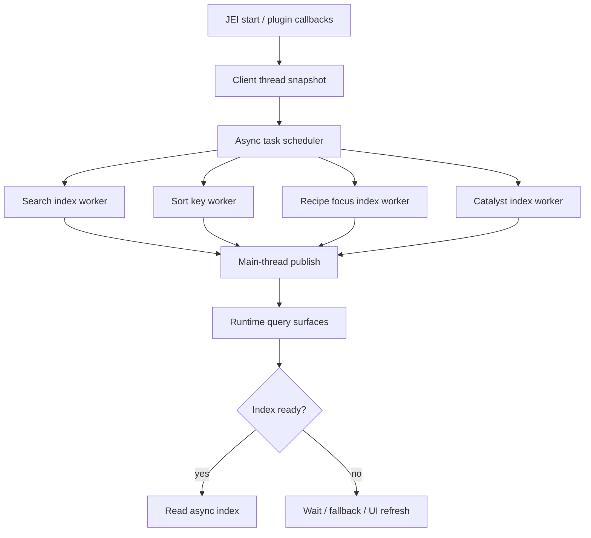

# JEI 异步优化 — Design Doc

> Goal: 在 Forge 1.20.1 环境中，通过 Mixin 优化 JEI 进入世界后的初始化与首次交互卡顿，同时保持 JEI 功能等价。
> In scope: 观测、单次启动内缓存、后台预热、双缓冲发布、搜索/排序/recipe 索引派生计算优化。
> Non-goals: 不修改其他模组 JEI Plugin；不跳过插件；不关闭 JEI 功能；不做本地跨世界/磁盘持久化缓存。
> Constraints: Minecraft 1.20.1、Forge 47.4.4、JEI 15.20.0.133、Stonecutter 0.9.6、Architectury Loom、Gradle 运行需 Java 21，源码编译目标 Java 17；每一个功能都必须能通过配置文件关闭。

## 1. Background / Problem

大型整合包中，许多模组会实现自己的 JEI Plugin。JEI 在进入世界后需要串行执行插件注册、构建 ingredient list、构建搜索索引、构建 recipe 反查索引、初始化 GUI/runtime。当前约束下不能修改其他插件，也不能通过禁用功能换取速度。

已有设计文档 [docs/jei-mixin-optimization-plan.md](../jei-mixin-optimization-plan.md) 已确认核心边界：

- JEI Plugin 回调必须保持原顺序和原线程语义。
- 不能在 worker thread 直接调用 `IModPlugin`、`IRecipeCategory`、`IIngredientHelper`、`IIngredientRenderer` 等第三方扩展点。
- 可以把 JEI 自己基于快照的派生计算移动到后台线程。
- 本地跨世界缓存已经明确移出设计；只允许一次 JEI start 生命周期内的短缓存。

当前项目是最小 Forge 1.20.1 + JEI 依赖骨架，Mixin 配置存在但尚未添加具体 mixin 类。

## 2. Approach / Core Principle

核心策略是“主线程取快照，后台建索引，主线程发布”：

1. 在 Minecraft client thread 上保持 JEI 原始调用顺序，收集完整、稳定、不可变快照。
2. Worker thread 只处理快照数据，构建搜索索引、排序结果、recipe UID map 等 JEI 派生结构。
3. 用 generation id、future 取消、双缓冲索引防止退出世界、reload、切服后的旧任务污染当前 runtime。
4. 所有优化必须有功能等价兜底：后台索引未就绪时等待、回退原同步路径，或仅在 GUI 层显示短暂“构建中”状态。
5. 所有非纯工具类功能入口都先检查配置开关；关闭后必须尽量走 JEI 原始路径或 no-op。

普通“首次使用才构建”的懒加载不作为主要方案，因为它只是把卡顿从进入世界转移到第一次搜索或第一次按 `R/U`。本设计要求每个懒加载索引都有后台预热调度。

## 3. Architecture & Key Decisions



### Key Decisions

| Decision | Choice | Rationale |
|---|---|---|
| Plugin execution | Keep serial on client thread | Third-party plugin code is not guaranteed thread-safe. |
| Cache scope | One `JeiStarter.start()` only | Avoid stale cross-world/server/data-pack/language results. |
| Async boundary | Snapshot first, worker second | Worker never touches unsafe Minecraft/JEI extension APIs. |
| Publish model | Generation id + main-thread atomic swap | Prevent old async results after logout/reload. |
| Lazy loading | Background preheat, not first-use sync build | Avoid moving the same freeze to first interaction. |
| Fallback | Original synchronous path or wait | Preserve complete JEI behavior under race/early use. |
| Feature gating | Forge client config with global and per-feature switches | Users can disable any optimization or diagnostic feature without rebuilding. |

## 4. Dependencies

- Hard:
  - Forge 1.20.1 / FML 47.x.
  - JEI runtime and API artifacts: `mezz.jei:jei-1.20.1-forge-api:15.20.0.133` and `mezz.jei:jei-1.20.1-forge:15.20.0.133`.
  - Mixin 0.8 via Forge/Loom.
  - Forge client config (`ForgeConfigSpec`, `ModLoadingContext.registerConfig`) for feature gates.
  - Java 21 to run Gradle/Stonecutter; Java 17 bytecode for Minecraft 1.20.1 runtime.
- Soft / optional:
  - JFR or external profiler for measurement only.
  - Log-based diagnostics for plugin-stage timing and registration counts.

## 5. Interfaces / Contracts

These contracts are draft here and must be frozen in the parallel plan before implementation.

### Package Layout

- `com.tonywww.jeioptimize`: mod entry and shared constants.
- `com.tonywww.jeioptimize.mixin`: Mixin classes only.
- `com.tonywww.jeioptimize.mixin.accessor`: Mixin accessors/invokers.
- `com.tonywww.jeioptimize.runtime`: generation, lifecycle, executor, task registry.
- `com.tonywww.jeioptimize.snapshot`: immutable snapshot records.
- `com.tonywww.jeioptimize.index`: async index abstractions and implementations.
- `com.tonywww.jeioptimize.instrumentation`: timing counters and reports.
- `com.tonywww.jeioptimize.config`: Forge client config schema and feature gates.

### Frozen Class Names

- `JeiOptRuntimeState`: generation id, lifecycle invalidation, task cancellation.
- `JeiOptExecutors`: bounded worker executor and main-thread publish helper.
- `AsyncIndexState`: `NOT_STARTED`, `SNAPSHOTTING`, `BUILDING`, `READY`, `FAILED`.
- `AsyncIndex<T>`: common state/future/result contract.
- `IngredientSearchSnapshot`: immutable ingredient search data.
- `RecipeIndexSnapshot`: immutable recipe role UID data.
- `JeiOptDiagnostics`: timing and registration count collection.
- `JeiOptConfig`: Forge client config registration and values.
- `JeiOptFeatureFlags`: small read-only facade used by mixins before changing behavior.

### Configuration Contract

Config file: `run/config/jei_optimize-client.toml`.

Every feature must have a boolean gate. Proposed keys:

| Key | Purpose |
|---|---|
| `general.enabled` | Master switch. If false, all mixin behavior should no-op or fall back to JEI behavior. |
| `diagnostics.pluginTiming` | Enable per-plugin/per-stage timing logs. |
| `diagnostics.registrationCounts` | Enable registration count instrumentation. |
| `syncOptimizations.cacheScope` | Enable one-start UID/string/sort helper cache. |
| `syncOptimizations.batchIngredientFilterInit` | Enable IngredientFilter batch initialization optimization. |
| `syncOptimizations.sortKeyCache` | Enable sort key and tag count short cache. |
| `syncOptimizations.delayCompact` | Enable delayed compact scheduling. |
| `async.searchPreheat` | Enable async search prefix index preheat. |
| `async.snapshotChunking` | Enable client-tick chunked snapshot extraction. |
| `async.sortPreheat` | Enable async sort computation. |
| `async.recipeFocusPreheat` | Enable async recipe focus index preheat. |
| `async.catalystPreheat` | Enable async catalyst index preheat. |
| `async.workerThreads` | Worker thread count, bounded integer. |
| `async.snapshotBudgetMs` | Per-client-tick snapshot extraction budget. |

### Safety Rules

- Worker thread may read only immutable snapshot DTOs and primitive/string/UID values.
- Worker thread must not call `IModPlugin`, `IRecipeCategory`, `IIngredientHelper`, `IIngredientRenderer`, `Minecraft`, `Screen`, or mutable `ItemStack` logic.
- Every async task carries a generation id and checks it before publishing.
- `JeiStarter.stop()` or reload invalidates generation and cancels pending tasks.
- Every mixin path that changes JEI behavior must check `general.enabled` and its own feature gate before acting.
- A disabled feature must not leave partial async state behind; disable means no-op or original JEI path.

## 6. Risks & Boundaries

| Risk | Level | Mitigation |
|---|---|---|
| Calling unsafe JEI/plugin APIs off-thread | H | Enforce snapshot-only worker API; code review every worker task. |
| Returning incomplete search/recipe results | H | Index state fallback: wait, original sync path, or GUI-only refresh. |
| Mixin target drift across JEI versions | M | Scope to JEI 15.20.0.133 first; add startup validation and fail-soft logs. |
| Async tasks publish after logout/reload | H | Generation id + cancellation + main-thread publish check. |
| Instrumentation changes behavior | M | Keep timing wrappers transparent; do not catch/suppress beyond JEI behavior. |
| Memory pressure from snapshots and double buffers | M | Bounded executor, release snapshots after publish, measure memory peak. |
| Config gates drift from implemented features | M | Config contract is frozen early; every feature task includes an acceptance check for its disable path. |

Boundaries — this will NOT do:

- No disk cache, persistent cache, or cross-world/server cache.
- No plugin blacklist, no recipe count cap, no feature disabling by default.
- No direct parallel execution of plugin registration callbacks.
- No worker-thread calls into renderer/helper/category/plugin APIs.
- No Fabric/NeoForge support in this first implementation pass.
- No feature without a config-file disable switch.

## 7. Verification Status

| Item | Status | Source / how to confirm |
|---|---|---|
| Project is Forge 1.20.1 with JEI dependency | verified | [build.gradle.kts](../../build.gradle.kts), [versions/1.20.1-forge/gradle.properties](../../versions/1.20.1-forge/gradle.properties). |
| JEI API artifact is separate, not classifier | verified | Maven lookup and project dependency: `jei-1.20.1-forge-api`. |
| `runClient` reached Forge/JEI startup | verified | Previous run showed `BUILD SUCCESSFUL` and JEI GUI atlas load. |
| Stonecutter 0.9.6 needs Java 21 runtime | verified | Gradle failure under Java 17; successful wrapper/client run under Java 21. |
| JEI internals exact bytecode names for planned mixin targets | verified | Recorded from JEI 15.20.0.133 source jars and `javap` in [jei-targets.md](jei-targets.md); implemented mixins compile and `runClient` smoke passes. |
| Worker-safe snapshot fields are sufficient for feature parity | partially verified | Snapshot builders and async indexes compile and `runClient` smoke passes; full search/R/U/catalyst equivalence matrices remain for PH-1/PH-3 validation. |
| Forge client config registration exact imports for 1.20.1 | verified | `JeiOptConfig` compiled; `runClient` generated `run/config/jei_optimize-client.toml` with all frozen keys. |
| Search/focus/catalyst async mixin wiring | partially verified | Relevant mixin classes are present in `jei_optimize.mixins.json`; `compileJava` and `runClient` pass. Full feature-on equivalence remains to be captured in validation. |

## 8. Open Questions

- Which features should default to enabled after baseline validation, and which should remain opt-in until equivalence checks are complete?
- Which async feature should become enabled by default first after validation: search, sort, recipe focus, or catalyst?
- Whether user-facing “index building” UI is needed; current implemented fallback strategy waits or falls back to baseline paths.
- How much main-thread tick budget should snapshot chunking use by default?

## 9. Key Skeletons

```java
public enum AsyncIndexState {
    NOT_STARTED,
    SNAPSHOTTING,
    BUILDING,
    READY,
    FAILED
}

public interface AsyncIndex<T> {
    AsyncIndexState state();
    CompletableFuture<T> future();
    Optional<T> readyValue();
    T awaitOrFallback(Supplier<T> fallback);
}

public record IngredientSearchSnapshot(
    Object uid,
    List<String> names,
    List<String> modNames,
    List<String> modIds,
    List<String> tooltipStrings,
    List<String> tagStrings,
    List<String> creativeTabStrings,
    List<String> colorStrings,
    String resourceLocation,
    boolean visible,
    int createdIndex
) {}
```

## Revision Log

- 2026-07-10 — Initial design derived from current JEI optimization notes and project skeleton.
- 2026-07-10 — PH-2 writeback: updated verification status after async search/sort/recipe/catalyst implementation, mixin wiring, compileJava, and runClient smoke.