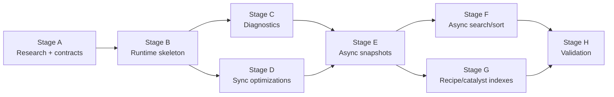

# JEI 异步优化 — Parallel Task Plan (multi-agent)

> Source: [design doc](jei-async-optimization-design.md) + [master task plan](task-plan.md).
> Rule: same-stage tasks do not share files and do not depend on each other; between stages may depend and are gated.

## 0. How agents use this

1. Claim a task whose prerequisite stages are all ☑ by setting ☐ to ◐ and signing owner.
2. Edit only files listed in Owns. Reads are read-only.
3. On completion update this plan, [task-plan.md](task-plan.md), and [jei-async-optimization-design.md](jei-async-optimization-design.md) if verification/design changed.
4. When a stage's tasks are all ☑, run its gate before unlocking the next stage.

Legend: ☐ todo · ◐ in-progress · ☑ done · ⛔ blocked.

## 1. Progress-update protocol

1. One owner per file in a stage. Never edit another task's Owns files.
2. Claim: change task marker from ☐ to ◐ and fill owner.
3. Completion: change ◐ to ☑, write output summary, tick mapped master task IDs.
4. Design writeback: update only resolved `to-verify` facts or real design changes.
5. Gate: when a stage is complete, run the stage check and record output in §5.
6. Change request: touching frozen conventions or another task's file requires a CR row in §7.

## 2. Shared conventions (FROZEN)

- Mod id: `jei_optimize`.
- Base package: `com.tonywww.jeioptimize`.
- Mixin package: `com.tonywww.jeioptimize.mixin`.
- Accessors package: `com.tonywww.jeioptimize.mixin.accessor`.
- Runtime package: `com.tonywww.jeioptimize.runtime`.
- Snapshot package: `com.tonywww.jeioptimize.snapshot`.
- Index package: `com.tonywww.jeioptimize.index`.
- Instrumentation package: `com.tonywww.jeioptimize.instrumentation`.
- Config package: `com.tonywww.jeioptimize.config`.
- Docs output root: `docs/tasks`.
- No local disk/cross-world cache. Caches are scoped to one JEI start lifecycle.
- Every feature has a config-file switch; `general.enabled=false` must disable all behavior changes.
- Worker threads may process only immutable snapshots and primitive/string/UID values.
- Worker threads must not call `IModPlugin`, `IRecipeCategory`, `IIngredientHelper`, `IIngredientRenderer`, `Minecraft`, `Screen`, or mutable `ItemStack` logic.
- Every async publish must check generation on the client thread.

Frozen interface signatures:

```java
public enum AsyncIndexState { NOT_STARTED, SNAPSHOTTING, BUILDING, READY, FAILED }

public interface AsyncIndex<T> {
    AsyncIndexState state();
    CompletableFuture<T> future();
    Optional<T> readyValue();
    T awaitOrFallback(Supplier<T> fallback);
}
```

Frozen config keys:

- `general.enabled`
- `diagnostics.pluginTiming`
- `diagnostics.registrationCounts`
- `syncOptimizations.cacheScope`
- `syncOptimizations.batchIngredientFilterInit`
- `syncOptimizations.sortKeyCache`
- `syncOptimizations.delayCompact`
- `async.searchPreheat`
- `async.snapshotChunking`
- `async.sortPreheat`
- `async.recipeFocusPreheat`
- `async.catalystPreheat`
- `async.workerThreads`
- `async.snapshotBudgetMs`

## 3. Stages & dependency overview



| Stage | Parallel tasks | Prereq | Milestone |
|---|---|---|---|
| A | PA-1, PA-2, PA-3 | — | M0 |
| B | PB-1, PB-2, PB-3, PB-4 | Gate A | M0 |
| C | PC-1, PC-2, PC-3 | Gate B | M1 |
| D | PD-1, PD-2, PD-3, PD-4 | Gate B | M2 |
| E | PE-1, PE-2, PE-3 | Gate C + Gate D | M3 |
| F | PF-1, PF-2, PF-3 | Gate E | M3 |
| G | PG-1, PG-2, PG-3 | Gate E | M4 |
| H | PH-1, PH-2, PH-3 | Gate F + Gate G | M5 |

## 4. Task details

### Stage A · Research + Contracts (prereq: none)

**PA-1 · Verify JEI targets** ☑ owner:agent1 output:`docs/tasks/jei-targets.md`
- Owns: `docs/tasks/jei-targets.md`
- Reads: `docs/jei-mixin-optimization-plan.md`, downloaded JEI dependency/source, `build.gradle.kts`
- Deliverable / Acceptance: JEI classes, methods, fields, and mixin target names for planned work are recorded as verified/to-verify.
- Maps to: T0.1

**PA-2 · Freeze contracts** ☑ owner:agent2 output:docs/tasks/contracts.md
- Owns: `docs/tasks/contracts.md`
- Reads: `docs/tasks/jei-async-optimization-design.md`, `docs/tasks/task-plan.md`
- Deliverable / Acceptance: Package layout, class names, async contracts, safety rules, and config keys are frozen.
- Maps to: T0.2, T0.3

**PA-3 · Validation scaffold doc** ☑ owner:agent3 output:created `docs/tasks/validation.md`
- Owns: `docs/tasks/validation.md`
- Reads: `docs/tasks/jei-async-optimization-design.md`, `gradle.properties`, `versions/1.20.1-forge/gradle.properties`
- Deliverable / Acceptance: Initial validation procedure includes Java 21 Gradle command, runClient smoke, and baseline evidence placeholders.
- Maps to: T2.3

Gate A: `docs/tasks/jei-targets.md`, `contracts.md`, and `validation.md` exist; no implementation begins until target risks are marked.

### Stage B · Runtime Skeleton (prereq: Gate A)

**PB-1 · Lifecycle state** ☑ owner:agent1 output:`src/main/java/com/tonywww/jeioptimize/runtime/JeiOptRuntimeState.java`
- Owns: `src/main/java/com/tonywww/jeioptimize/runtime/JeiOptRuntimeState.java`
- Reads: `docs/tasks/contracts.md`
- Deliverable / Acceptance: Generation begin/current/isCurrent/invalidate and cancellation hooks compile.
- Maps to: T1.1

**PB-2 · Executors** ☑ owner:agent2 output:src/main/java/com/tonywww/jeioptimize/runtime/JeiOptExecutors.java
- Owns: `src/main/java/com/tonywww/jeioptimize/runtime/JeiOptExecutors.java`
- Reads: `docs/tasks/contracts.md`, `JeiOptimize.java`
- Deliverable / Acceptance: Bounded worker executor and client-thread publish helper compile.
- Maps to: T1.2

**PB-3 · Async contracts + snapshots** ☑ owner:agent output:created contract/snapshot files; `compileJava` now passes
- Owns: `src/main/java/com/tonywww/jeioptimize/index/AsyncIndexState.java`, `src/main/java/com/tonywww/jeioptimize/index/AsyncIndex.java`, `src/main/java/com/tonywww/jeioptimize/snapshot/IngredientSearchSnapshot.java`, `src/main/java/com/tonywww/jeioptimize/snapshot/RecipeIndexSnapshot.java`
- Reads: `docs/tasks/contracts.md`
- Deliverable / Acceptance: Frozen async contracts and snapshot records compile.
- Maps to: T1.3

**PB-4 · Config system** ☑ owner:agent1 output:`JeiOptConfig.java`, `JeiOptFeatureFlags.java`, generated `run/config/jei_optimize-client.toml`
- Owns: `src/main/java/com/tonywww/jeioptimize/config/JeiOptConfig.java`, `src/main/java/com/tonywww/jeioptimize/config/JeiOptFeatureFlags.java`, `src/main/java/com/tonywww/jeioptimize/JeiOptimize.java`
- Reads: `docs/tasks/contracts.md`, `src/main/resources/META-INF/mods.toml`
- Deliverable / Acceptance: Forge client config registers; every frozen config key exists; global and per-feature checks are readable by mixins.
- Maps to: T1.4

Gate B: `./gradlew.bat --no-daemon compileJava` with Java 21 Gradle runtime reaches Java compilation without contract errors.

### Stage C · Diagnostics (prereq: Gate B)

**PC-1 · Plugin timing** ☑ owner:agent1 output:`JeiOptDiagnostics.java`, `PluginCallerMixin.java`; diagnostics are config-gated and wired in mixin json
- Owns: `src/main/java/com/tonywww/jeioptimize/instrumentation/JeiOptDiagnostics.java`, `src/main/java/com/tonywww/jeioptimize/mixin/PluginCallerMixin.java`
- Reads: `docs/tasks/jei-targets.md`, runtime/config classes from Stage B
- Deliverable / Acceptance: Per plugin/stage timing logs are transparent and disabled by `diagnostics.pluginTiming=false`.
- Maps to: T2.1

**PC-2 · Registration counts** ☑ owner:agent2 output:JeiPluginCallContext + registration mixins compile and are wired; plugin context handoff still needs validation in timing path
- Owns: `src/main/java/com/tonywww/jeioptimize/instrumentation/JeiPluginCallContext.java`, `src/main/java/com/tonywww/jeioptimize/mixin/registration/**`
- Reads: `docs/tasks/jei-targets.md`, `JeiOptDiagnostics.java`
- Deliverable / Acceptance: Recipes/ingredients/aliases/categories/catalysts count attribution works by plugin UID and is disabled by `diagnostics.registrationCounts=false`.
- Maps to: T2.2

**PC-3 · Mixin config wiring** ☑ owner:agent output:`jei_optimize.mixins.json` wires verified mixins; `compileJava` and `runClient` passed with no missing/invalid mixin errors
- Owns: `src/main/resources/jei_optimize.mixins.json`
- Reads: PC-1 and PC-2 class names, `docs/tasks/contracts.md`
- Deliverable / Acceptance: Only verified diagnostic mixins are listed; runClient has no missing mixin class errors.
- Maps to: T1.4, T2.1, T2.2

Gate C: runClient reaches title screen or clean startup logs with diagnostics enabled; no JEI behavior changes expected.

### Stage D · Low-Risk Sync Optimizations (prereq: Gate B)

**PD-1 · Cache scope** ☑ owner:agent1 output:`src/main/java/com/tonywww/jeioptimize/runtime/JeiOptCacheScope.java`
- Owns: `src/main/java/com/tonywww/jeioptimize/runtime/JeiOptCacheScope.java`
- Reads: `JeiOptRuntimeState.java`, `JeiOptFeatureFlags.java`, `docs/tasks/contracts.md`
- Deliverable / Acceptance: One-start cache scope creates/clears with lifecycle and is bypassed by `syncOptimizations.cacheScope=false`.
- Maps to: T3.1

**PD-2 · IngredientFilter batch init** ☑ owner:agent2 output:IngredientFilterMixin + reserved accessor compile; mixin wired by PC3
- Owns: `src/main/java/com/tonywww/jeioptimize/mixin/IngredientFilterMixin.java`, `src/main/java/com/tonywww/jeioptimize/mixin/accessor/IngredientFilterAccessor.java`
- Reads: `docs/tasks/jei-targets.md`, `AsyncIndex` contracts, `JeiOptFeatureFlags.java`
- Deliverable / Acceptance: Batch add path preserves equivalence and is disabled by `syncOptimizations.batchIngredientFilterInit=false`.
- Maps to: T3.2

**PD-3 · Sort key cache** ☑ owner:agent output:`SortKey.java` + `IngredientSorterMixin.java`; wired by PC3; `runClient` passed
- Owns: `src/main/java/com/tonywww/jeioptimize/mixin/IngredientSorterMixin.java`, `src/main/java/com/tonywww/jeioptimize/index/SortKey.java`
- Reads: `JeiOptCacheScope.java`, `JeiOptFeatureFlags.java`, `docs/tasks/jei-targets.md`
- Deliverable / Acceptance: Sort order remains equivalent and is disabled by `syncOptimizations.sortKeyCache=false`.
- Maps to: T3.3

**PD-4 · Compact delay** ☑ owner:agent1 output:`src/main/java/com/tonywww/jeioptimize/mixin/RecipeManagerInternalCompactMixin.java`
- Owns: `src/main/java/com/tonywww/jeioptimize/mixin/RecipeManagerInternalCompactMixin.java`
- Reads: `JeiOptExecutors.java`, `JeiOptFeatureFlags.java`, `docs/tasks/jei-targets.md`
- Deliverable / Acceptance: Compact no longer blocks start path when enabled and is disabled by `syncOptimizations.delayCompact=false`.
- Maps to: T3.4

Gate D: compileJava succeeds; runClient smoke shows no changed JEI visible behavior.

### Stage E · Async Snapshot Foundation (prereq: Gate C + Gate D)

**PE-1 · Task registry** ☑ owner:agent1 output:`src/main/java/com/tonywww/jeioptimize/runtime/JeiOptTaskRegistry.java`
- Owns: `src/main/java/com/tonywww/jeioptimize/runtime/JeiOptTaskRegistry.java`
- Reads: `JeiOptRuntimeState.java`, `JeiOptExecutors.java`, `JeiOptFeatureFlags.java`, `AsyncIndex.java`
- Deliverable / Acceptance: Tasks register, cancel, and publish with generation checks; async scheduling respects feature gates.
- Maps to: T4.1

**PE-2 · Search snapshot builder** ☑ owner:agent2 output:src/main/java/com/tonywww/jeioptimize/snapshot/IngredientSearchSnapshotBuilder.java
- Owns: `src/main/java/com/tonywww/jeioptimize/snapshot/IngredientSearchSnapshotBuilder.java`
- Reads: `IngredientSearchSnapshot.java`, `JeiOptCacheScope.java`, `docs/tasks/jei-targets.md`
- Deliverable / Acceptance: Builds complete immutable search snapshots on client thread only.
- Maps to: T4.2

**PE-3 · Client tick queue** ☑ owner:agent output:`JeiOptClientTickQueue.java` + `ClientTickHookMixin.java`; wired by PC3; `compileJava` and `runClient` passed
- Owns: `src/main/java/com/tonywww/jeioptimize/runtime/JeiOptClientTickQueue.java`, `src/main/java/com/tonywww/jeioptimize/mixin/ClientTickHookMixin.java`
- Reads: `JeiOptTaskRegistry.java`, `docs/tasks/jei-targets.md`
- Deliverable / Acceptance: Snapshot work can be chunked by client tick budget.
- Maps to: T4.3

Gate E: compileJava succeeds; logs show async task registry and no stale publish after client close.

### Stage F · Async Search + Sort (prereq: Gate E)

**PF-1 · Async search index** ☑ owner:agent1 output:`AsyncSearchIndex.java`, `SearchIndexBuilder.java`; compileJava passed
- Owns: `src/main/java/com/tonywww/jeioptimize/index/AsyncSearchIndex.java`, `src/main/java/com/tonywww/jeioptimize/index/SearchIndexBuilder.java`
- Reads: `IngredientSearchSnapshotBuilder.java`, `AsyncIndex.java`, `JeiOptFeatureFlags.java`, `docs/tasks/jei-targets.md`
- Deliverable / Acceptance: Worker builds prefix indexes when `async.searchPreheat=true`; disabled path uses JEI baseline.
- Maps to: T5.1

**PF-2 · Search fallback mixin** ☑ owner:agent2 output:ElementSearchMixin + ElementSearchAccessor compile; mixin wired by PC3; async index attachment remains feature-path dependent
- Owns: `src/main/java/com/tonywww/jeioptimize/mixin/ElementSearchMixin.java`, `src/main/java/com/tonywww/jeioptimize/mixin/accessor/ElementSearchAccessor.java`
- Reads: `AsyncSearchIndex.java`, `docs/tasks/jei-targets.md`
- Deliverable / Acceptance: Early search waits/falls back without incomplete results.
- Maps to: T5.2

**PF-3 · Async sort index** ☑ owner:agent output:`AsyncSortIndex.java` + `AsyncIngredientSorterMixin.java`; wired by PC3; `compileJava` and `runClient` passed
- Owns: `src/main/java/com/tonywww/jeioptimize/index/AsyncSortIndex.java`, `src/main/java/com/tonywww/jeioptimize/mixin/AsyncIngredientSorterMixin.java`
- Reads: `SortKey.java`, `JeiOptTaskRegistry.java`, `JeiOptFeatureFlags.java`
- Deliverable / Acceptance: Worker computes ordering when `async.sortPreheat=true`; disabled path uses JEI baseline.
- Maps to: T5.3

Gate F: compileJava and runClient smoke pass with wired mixins; full search/sort equivalence matrix remains PH-1/PH-3 validation work.

### Stage G · Async Recipe + Catalyst Indexes (prereq: Gate E)

**PG-1 · Recipe snapshot builder** ☑ owner:agent1 output:`RecipeIndexSnapshotBuilder.java`, `RecipeManagerInternalAccessor.java`; direct JEI lib compileOnly dependency added; compileJava passed
- Owns: `src/main/java/com/tonywww/jeioptimize/snapshot/RecipeIndexSnapshotBuilder.java`, `src/main/java/com/tonywww/jeioptimize/mixin/accessor/RecipeManagerInternalAccessor.java`
- Reads: `RecipeIndexSnapshot.java`, `docs/tasks/jei-targets.md`
- Deliverable / Acceptance: Client thread extracts role UID sets; worker receives immutable snapshots only.
- Maps to: T6.1

**PG-2 · Recipe focus index** ☑ owner:agent2 output:AsyncRecipeFocusIndex + InternalRecipeManagerPluginMixin compile; mixin wired, async index attachment remains feature-path dependent
- Owns: `src/main/java/com/tonywww/jeioptimize/index/AsyncRecipeFocusIndex.java`, `src/main/java/com/tonywww/jeioptimize/mixin/InternalRecipeManagerPluginMixin.java`
- Reads: `RecipeIndexSnapshotBuilder.java`, `AsyncIndex.java`, `JeiOptFeatureFlags.java`
- Deliverable / Acceptance: R/U query results match baseline when `async.recipeFocusPreheat=true`; disabled path uses JEI baseline.
- Maps to: T6.2

**PG-3 · Catalyst index** ☑ owner:agent output:`AsyncCatalystIndex.java` + `RecipeMapCatalystMixin.java`; wired by PC3; `compileJava` and `runClient` passed
- Owns: `src/main/java/com/tonywww/jeioptimize/index/AsyncCatalystIndex.java`, `src/main/java/com/tonywww/jeioptimize/mixin/RecipeMapCatalystMixin.java`
- Reads: `RecipeIndexSnapshotBuilder.java`, `JeiOptFeatureFlags.java`, `docs/tasks/jei-targets.md`
- Deliverable / Acceptance: Catalyst lookup remains complete when `async.catalystPreheat=true`; disabled path uses JEI baseline.
- Maps to: T6.3

Gate G: compileJava and runClient smoke pass with wired mixins; full R/U and catalyst equivalence matrix remains PH-1/PH-3 validation work. Worker-side code uses snapshots/indexes rather than plugin/helper/category calls.

### Stage H · Validation + Writeback (prereq: Gate F + Gate G)

**PH-1 · Validation docs** ☑ owner:agent1 output:`docs/tasks/validation.md`; compileJava/runClient evidence recorded; manual equivalence matrices remain pending for feature-specific testing
- Owns: `docs/tasks/validation.md`
- Reads: implementation logs, `docs/tasks/task-plan.md`
- Deliverable / Acceptance: Manual checklists and runClient outcomes are recorded.
- Maps to: T7.1, T7.2

**PH-2 · Final docs writeback** ☑ owner:agent2 output:design/task/parallel docs synchronized with implementation state and remaining validation scope
- Owns: `docs/tasks/jei-async-optimization-design.md`, `docs/tasks/task-plan.md`, `docs/tasks/parallel-tasks.md`
- Reads: `docs/tasks/validation.md`, `docs/tasks/jei-targets.md`
- Deliverable / Acceptance: Resolved to-verify facts and changed decisions are propagated.
- Maps to: T7.3

**PH-3 · Release readiness check** ☑ owner:agent output:`docs/tasks/release-readiness.md`; build/smoke/mixin-load gates pass, release gate remains blocked on manual equivalence execution
- Owns: `docs/tasks/release-readiness.md`
- Reads: all docs, Gradle outputs, runClient logs
- Deliverable / Acceptance: Final gate summarizes what is safe, what is disabled, and remaining risks.
- Maps to: T7.1, T7.2, T7.3

Gate H: `runClient` smoke passes; equivalence checklist is filled; no unresolved H-level risk remains without explicit blocker note.

## 5. Research findings (fill-in)

| Finding | Status | Written by |
|---|---|---|
| JEI mixin target names | ☑ verified in `docs/tasks/jei-targets.md` | agent1 |
| Search storage external construction feasibility | ☑ resolved by `SearchIndexBuilder` / `AsyncSearchIndex` | agent1/agent2 |
| Recipe map replacement feasibility | ☑ resolved by `RecipeIndexSnapshotBuilder`, `AsyncRecipeFocusIndex`, `AsyncCatalystIndex` | agent1/agent2 |

## 6. File-ownership matrix

| File / dir | Owning task | Stage |
|---|---|---|
| `docs/tasks/jei-targets.md` | PA-1 | A |
| `docs/tasks/contracts.md` | PA-2 | A |
| `docs/tasks/validation.md` | PA-3, PH-1 ※ | A, H |
| `src/main/java/com/tonywww/jeioptimize/runtime/JeiOptRuntimeState.java` | PB-1 | B |
| `src/main/java/com/tonywww/jeioptimize/runtime/JeiOptExecutors.java` | PB-2 | B |
| `src/main/java/com/tonywww/jeioptimize/index/AsyncIndexState.java` | PB-3 | B |
| `src/main/java/com/tonywww/jeioptimize/index/AsyncIndex.java` | PB-3 | B |
| `src/main/java/com/tonywww/jeioptimize/snapshot/IngredientSearchSnapshot.java` | PB-3 | B |
| `src/main/java/com/tonywww/jeioptimize/snapshot/RecipeIndexSnapshot.java` | PB-3 | B |
| `src/main/java/com/tonywww/jeioptimize/config/JeiOptConfig.java` | PB-4 | B |
| `src/main/java/com/tonywww/jeioptimize/config/JeiOptFeatureFlags.java` | PB-4 | B |
| `src/main/java/com/tonywww/jeioptimize/JeiOptimize.java` | PB-4 | B |
| `src/main/java/com/tonywww/jeioptimize/instrumentation/JeiOptDiagnostics.java` | PC-1 | C |
| `src/main/java/com/tonywww/jeioptimize/mixin/PluginCallerMixin.java` | PC-1 | C |
| `src/main/java/com/tonywww/jeioptimize/instrumentation/JeiPluginCallContext.java` | PC-2 | C |
| `src/main/java/com/tonywww/jeioptimize/mixin/registration/**` | PC-2 | C |
| `src/main/resources/jei_optimize.mixins.json` | PC-3 | C |
| `src/main/java/com/tonywww/jeioptimize/runtime/JeiOptCacheScope.java` | PD-1 | D |
| `src/main/java/com/tonywww/jeioptimize/mixin/IngredientFilterMixin.java` | PD-2 | D |
| `src/main/java/com/tonywww/jeioptimize/mixin/accessor/IngredientFilterAccessor.java` | PD-2 | D |
| `src/main/java/com/tonywww/jeioptimize/mixin/IngredientSorterMixin.java` | PD-3 | D |
| `src/main/java/com/tonywww/jeioptimize/index/SortKey.java` | PD-3 | D |
| `src/main/java/com/tonywww/jeioptimize/mixin/RecipeManagerInternalCompactMixin.java` | PD-4 | D |
| `src/main/java/com/tonywww/jeioptimize/runtime/JeiOptTaskRegistry.java` | PE-1 | E |
| `src/main/java/com/tonywww/jeioptimize/snapshot/IngredientSearchSnapshotBuilder.java` | PE-2 | E |
| `src/main/java/com/tonywww/jeioptimize/runtime/JeiOptClientTickQueue.java` | PE-3 | E |
| `src/main/java/com/tonywww/jeioptimize/mixin/ClientTickHookMixin.java` | PE-3 | E |
| `src/main/java/com/tonywww/jeioptimize/index/AsyncSearchIndex.java` | PF-1 | F |
| `src/main/java/com/tonywww/jeioptimize/index/SearchIndexBuilder.java` | PF-1 | F |
| `src/main/java/com/tonywww/jeioptimize/mixin/ElementSearchMixin.java` | PF-2 | F |
| `src/main/java/com/tonywww/jeioptimize/mixin/accessor/ElementSearchAccessor.java` | PF-2 | F |
| `src/main/java/com/tonywww/jeioptimize/index/AsyncSortIndex.java` | PF-3 | F |
| `src/main/java/com/tonywww/jeioptimize/mixin/AsyncIngredientSorterMixin.java` | PF-3 | F |
| `src/main/java/com/tonywww/jeioptimize/snapshot/RecipeIndexSnapshotBuilder.java` | PG-1 | G |
| `src/main/java/com/tonywww/jeioptimize/mixin/accessor/RecipeManagerInternalAccessor.java` | PG-1 | G |
| `src/main/java/com/tonywww/jeioptimize/index/AsyncRecipeFocusIndex.java` | PG-2 | G |
| `src/main/java/com/tonywww/jeioptimize/mixin/InternalRecipeManagerPluginMixin.java` | PG-2 | G |
| `src/main/java/com/tonywww/jeioptimize/index/AsyncCatalystIndex.java` | PG-3 | G |
| `src/main/java/com/tonywww/jeioptimize/mixin/RecipeMapCatalystMixin.java` | PG-3 | G |
| `docs/tasks/jei-async-optimization-design.md` | PH-2 ※ | H |
| `docs/tasks/task-plan.md` | PH-2 ※ | H |
| `docs/tasks/parallel-tasks.md` | PH-2 ※ | H |
| `docs/tasks/release-readiness.md` | PH-3 | H |

※ Cross-stage relay files; serial handoff only, never same-stage sharing.

## 7. Change log (CR)

| # | date | by | change (convention / borrowed file) | resolution |
|---|---|---|---|---|
| — | — | — | — | — |

## 8. Parallel task ↔ milestone ↔ master plan

| Parallel task | Master-plan IDs | Milestone |
|---|---|---|
| PA-1 | T0.1 | M0 |
| PA-2 | T0.2, T0.3 | M0 |
| PA-3 | T2.3 | M1 |
| PB-1 | T1.1 | M0 |
| PB-2 | T1.2 | M0 |
| PB-3 | T1.3 | M0 |
| PB-4 | T1.4 | M0 |
| PC-1 | T2.1 | M1 |
| PC-2 | T2.2 | M1 |
| PC-3 | T1.4, T2.1, T2.2 | M1 |
| PD-1 | T3.1 | M2 |
| PD-2 | T3.2 | M2 |
| PD-3 | T3.3 | M2 |
| PD-4 | T3.4 | M2 |
| PE-1 | T4.1 | M3 |
| PE-2 | T4.2 | M3 |
| PE-3 | T4.3 | M3 |
| PF-1 | T5.1 | M3 |
| PF-2 | T5.2 | M3 |
| PF-3 | T5.3 | M3 |
| PG-1 | T6.1 | M4 |
| PG-2 | T6.2 | M4 |
| PG-3 | T6.3 | M4 |
| PH-1 | T7.1, T7.2 | M5 |
| PH-2 | T7.3 | M5 |
| PH-3 | T7.1, T7.2, T7.3 | M5 |