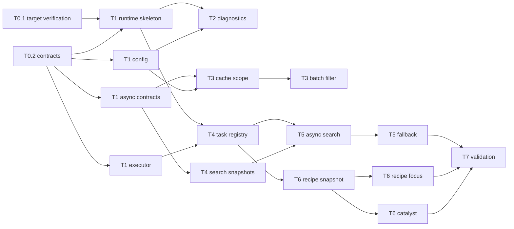

# JEI 异步优化 — Master Task Plan

> Source: [design doc](jei-async-optimization-design.md). Scope: Forge 1.20.1 / JEI 15.20.0.133 / Mixin-only async optimization.
> Status: ☐ todo · ◐ in-progress · ☑ done · ⛔ blocked. Complexity: S / M / L. No time estimates.

## Milestones

| Milestone | Goal (deliverable & verifiable) | Stages |
|---|---|---|
| M0 | Contracts, config gates, JEI target verification, and instrumentation scaffolding are in place. | Stage 0–1 |
| M1 | Baseline diagnostics report plugin/JEI phase timing without behavior changes. | Stage 2 |
| M2 | Low-risk synchronous optimizations and lifecycle-local caches are implemented. | Stage 3 |
| M3 | Async runtime foundation and search/sort background preheat are implemented. | Stage 4–5 |
| M4 | Recipe/catalyst async index path is implemented with complete fallback. | Stage 6 |
| M5 | Full runClient validation and equivalence checks are documented. | Stage 7 |

## Stage 0 · Research & Contracts → M0

| ID | Task | Cx | Deps | Acceptance criteria | Files |
|---|---|---|---|---|---|
| ☑ T0.1 | Verify JEI jar/source internals for all proposed mixin targets. | M | — | Target classes/methods/field names are recorded with source or bytecode evidence; unresolved targets marked to-verify. | `docs/tasks/jei-targets.md` |
| ☑ T0.2 | Freeze project package layout and async contracts. | S | — | Package layout and class/interface names match design §5; downstream tasks can depend on them. | `docs/tasks/contracts.md` |
| ☑ T0.3 | Define config schema and feature gates. | S | — | Every diagnostic, sync optimization, async preheat, and fallback feature has a documented config key and disable semantics. | `docs/tasks/contracts.md` |

## Stage 1 · Runtime Skeleton → M0

| ID | Task | Cx | Deps | Acceptance criteria | Files |
|---|---|---|---|---|---|
| ☑ T1.1 | Implement lifecycle generation and task cancellation skeleton. | M | T0.2 | `JeiOptRuntimeState` compiles and exposes begin/current/isCurrent/invalidate/cancel hooks. | `src/main/java/com/tonywww/jeioptimize/runtime/JeiOptRuntimeState.java` |
| ☑ T1.2 | Implement bounded executor and main-thread publish utility. | M | T0.2 | `JeiOptExecutors` compiles, uses bounded daemon worker pool, and publishes via Minecraft client thread. | `src/main/java/com/tonywww/jeioptimize/runtime/JeiOptExecutors.java` |
| ☑ T1.3 | Implement async index contracts and snapshot records. | M | T0.2 | `AsyncIndexState`, `AsyncIndex`, `IngredientSearchSnapshot`, `RecipeIndexSnapshot` compile; full `compileJava` now succeeds after PB-4 added the shared logger on `JeiOptimize`. | `src/main/java/com/tonywww/jeioptimize/index/AsyncIndexState.java`, `src/main/java/com/tonywww/jeioptimize/index/AsyncIndex.java`, `src/main/java/com/tonywww/jeioptimize/snapshot/IngredientSearchSnapshot.java`, `src/main/java/com/tonywww/jeioptimize/snapshot/RecipeIndexSnapshot.java` |
| ☑ T1.4 | Implement Forge client config and feature flag facade. | M | T0.3 | `JeiOptConfig` registers a client config file; every documented key exists; `JeiOptFeatureFlags` exposes read-only checks. | `src/main/java/com/tonywww/jeioptimize/config/JeiOptConfig.java`, `src/main/java/com/tonywww/jeioptimize/config/JeiOptFeatureFlags.java`, `src/main/java/com/tonywww/jeioptimize/JeiOptimize.java` |
| ☑ T1.5 | Wire empty mixin package and config entries for future mixins. | S | T0.1, T1.4 | `jei_optimize.mixins.json` wires verified mixins; `compileJava` and `runClient` pass with no missing/invalid mixin errors. | `src/main/resources/jei_optimize.mixins.json`, `src/main/java/com/tonywww/jeioptimize/mixin/**` |

## Stage 2 · Diagnostics Baseline → M1

| ID | Task | Cx | Deps | Acceptance criteria | Files |
|---|---|---|---|---|---|
| ☑ T2.1 | Add transparent plugin phase timing instrumentation. | M | T0.1, T1.1, T1.4 | Timing mixin and diagnostics compile, are config-gated, and are wired in `jei_optimize.mixins.json`; runClient smoke passes. | `src/main/java/com/tonywww/jeioptimize/instrumentation/JeiOptDiagnostics.java`, `src/main/java/com/tonywww/jeioptimize/mixin/PluginCallerMixin.java`, `src/main/resources/jei_optimize.mixins.json` |
| ☑ T2.2 | Add registration count instrumentation. | M | T1.4, T2.1 | Counts for recipes, ingredients, aliases, categories, catalysts are associated with current plugin UID when enabled; disabled path is no-op. | `src/main/java/com/tonywww/jeioptimize/instrumentation/JeiPluginCallContext.java`, registration mixins under `src/main/java/com/tonywww/jeioptimize/mixin/` |
| ☑ T2.3 | Document baseline runClient and measurement procedure. | S | T2.1 | Repro command, Java 21 Gradle note, and expected log markers are documented. | `docs/tasks/validation.md` |

## Stage 3 · Low-Risk Sync Optimizations → M2

| ID | Task | Cx | Deps | Acceptance criteria | Files |
|---|---|---|---|---|---|
| ☑ T3.1 | Add one-start cache scope for UID/string/sort helper values. | M | T1.1, T1.3, T1.4 | Cache clears on stop/reload and never writes disk; disabled config path bypasses cache. | `src/main/java/com/tonywww/jeioptimize/runtime/JeiOptCacheScope.java` |
| ☑ T3.2 | Optimize IngredientFilter initialization via batch add. | M | T0.1, T1.3, T1.4 | Ingredient list/search results remain equivalent; disabled config path keeps JEI constructor behavior. | `src/main/java/com/tonywww/jeioptimize/mixin/IngredientFilterMixin.java`, accessors as needed |
| ☑ T3.3 | Add sort key and tag count short cache. | M | T1.4, T3.1 | `SortKey` and `IngredientSorterMixin` compile and are wired; disabled config path bypasses cache; `runClient` passes. | `src/main/java/com/tonywww/jeioptimize/mixin/IngredientSorterMixin.java`, `src/main/java/com/tonywww/jeioptimize/index/SortKey.java`, `src/main/java/com/tonywww/jeioptimize/runtime/JeiOptCacheScope.java` |
| ☑ T3.4 | Delay compact operations safely. | S | T0.1, T1.2, T1.4 | Compact does not block start path when enabled; disabled config path runs JEI compact normally. | `src/main/java/com/tonywww/jeioptimize/mixin/RecipeManagerInternalCompactMixin.java` |

## Stage 4 · Async Runtime & Search Snapshot → M3

| ID | Task | Cx | Deps | Acceptance criteria | Files |
|---|---|---|---|---|---|
| ☑ T4.1 | Implement async task registry and generation-safe publish path. | M | T1.1, T1.2, T1.3, T1.4 | Tasks publish only on matching generation; all async scheduling respects config gates. | `src/main/java/com/tonywww/jeioptimize/runtime/JeiOptTaskRegistry.java`, `src/main/java/com/tonywww/jeioptimize/runtime/JeiOptRuntimeState.java` |
| ☑ T4.2 | Implement ingredient search snapshot builder. | L | T0.1, T1.3, T1.4, T3.1 | Snapshot captures all required fields when enabled; disabled config path skips snapshot creation. | `src/main/java/com/tonywww/jeioptimize/snapshot/IngredientSearchSnapshotBuilder.java` |
| ☑ T4.3 | Implement chunked main-thread snapshot queue. | L | T1.4, T4.1, T4.2 | Snapshot extraction can be budgeted per tick when enabled; disabled config path clears queued work; `ClientTickHookMixin` is wired and `runClient` passes. | `src/main/java/com/tonywww/jeioptimize/runtime/JeiOptClientTickQueue.java`, related mixin/event wiring |

## Stage 5 · Async Search & Sort Indexes → M3

| ID | Task | Cx | Deps | Acceptance criteria | Files |
|---|---|---|---|---|---|
| ☑ T5.1 | Build async search prefix indexes from snapshots. | L | T1.4, T4.1, T4.2 | Worker builds search storage when enabled; disabled config path uses JEI baseline search. | `src/main/java/com/tonywww/jeioptimize/index/AsyncSearchIndex.java`, `src/main/java/com/tonywww/jeioptimize/index/SearchIndexBuilder.java` |
| ☑ T5.2 | Add search fallback semantics for not-ready indexes. | M | T1.4, T5.1 | Unblocked by PF-1 outputs; early query waits, refreshes, or falls back; all fallback behavior is config-controlled. | `src/main/java/com/tonywww/jeioptimize/index/AsyncSearchIndex.java` |
| ☑ T5.3 | Move sort work to async snapshot-based computation where safe. | M | T1.4, T3.3, T4.1 | `AsyncSortIndex` and `AsyncIngredientSorterMixin` compile and are wired; worker processes only integer sort-key snapshots when `async.sortPreheat=true`; disabled config path uses JEI sorting. `runClient` passes. | `src/main/java/com/tonywww/jeioptimize/index/AsyncSortIndex.java`, `src/main/java/com/tonywww/jeioptimize/mixin/AsyncIngredientSorterMixin.java` |

## Stage 6 · Recipe & Catalyst Async Indexes → M4

| ID | Task | Cx | Deps | Acceptance criteria | Files |
|---|---|---|---|---|---|
| ☑ T6.1 | Implement recipe index snapshot generation on client thread. | L | T0.1, T1.4, T4.1 | Snapshot generation runs only when recipe async features are enabled; disabled config path uses JEI baseline. | `src/main/java/com/tonywww/jeioptimize/snapshot/RecipeIndexSnapshotBuilder.java`, `src/main/java/com/tonywww/jeioptimize/mixin/accessor/RecipeManagerInternalAccessor.java` |
| ☑ T6.2 | Build async recipe focus maps from snapshots. | L | T1.4, T6.1 | Unblocked by PG-1 outputs; R/U queries match baseline when enabled; disabled config path uses JEI recipe focus logic. | `src/main/java/com/tonywww/jeioptimize/index/AsyncRecipeFocusIndex.java` |
| ☑ T6.3 | Build async catalyst maps and fallback path. | M | T1.4, T6.1 | `AsyncCatalystIndex` and `RecipeMapCatalystMixin` compile and are wired; disabled config path uses JEI catalyst logic. `runClient` passes. | `src/main/java/com/tonywww/jeioptimize/index/AsyncCatalystIndex.java`, `src/main/java/com/tonywww/jeioptimize/mixin/RecipeMapCatalystMixin.java` |

## Stage 7 · Validation & Hardening → M5

| ID | Task | Cx | Deps | Acceptance criteria | Files |
|---|---|---|---|---|---|
| ☑ T7.1 | Add equivalence checklist and manual validation script. | M | T5.2, T6.2 | Search, R/U, catalyst, reload, logout/re-enter checks are documented and repeatable. Manual equivalence matrix execution remains pending for release readiness. | `docs/tasks/validation.md` |
| ☑ T7.2 | Run `runClient` smoke tests and capture results. | M | T7.1 | Gradle runClient reaches Forge/JEI startup; current compileJava/runClient evidence is captured in `validation.md`. | `docs/tasks/validation.md` |
| ☑ T7.3 | Update design/task docs with resolved to-verify items. | S | T7.1 | PH-2 synchronized design/task/parallel docs with implementation state and remaining validation scope. | `docs/tasks/jei-async-optimization-design.md`, `docs/tasks/task-plan.md`, `docs/tasks/parallel-tasks.md` |

## Dependency Graph

Critical path: T0.1/T0.2 → T1.1/T1.2/T1.3 → T4.1/T4.2 → T5.1/T5.2 → T7.1/T7.2. Recipe async work T6 is a second critical branch for M4.

## Blocking Research / To-Verify

| ID | Item | Blocks | How to resolve |
|---|---|---|---|
| ☑ R1 | Exact JEI 15.20.0.133 internal method/field names for mixin targets. | T1.5, T2.*, T3.*, T4.*, T5.*, T6.* | Resolved in `docs/tasks/jei-targets.md`; implemented mixins compile and runClient smoke passes. |
| ☑ R5 | Forge 1.20.1 client config registration imports and generated file name. | T1.4 | Resolved by `JeiOptConfig`; generated `run/config/jei_optimize-client.toml`. |
| ☑ R2 | Whether `IngredientFilter` constructor can be safely redirected without overwrite. | T3.2 | Implemented pseudo redirect/inject guarded by `syncOptimizations.batchIngredientFilterInit`; compileJava passes. Full equivalence remains in validation. |
| ☑ R3 | Whether search storage classes can be built externally without private constructors. | T5.1 | Resolved by project-owned `SearchIndexBuilder` / `AsyncSearchIndex`; compileJava passes. Full equivalence remains in validation. |
| ☑ R4 | Recipe map replacement/access pattern. | T6.* | Resolved via project-owned snapshot/index maps plus query mixins; compileJava and runClient pass. Full R/U/catalyst equivalence remains in validation. |

## Risk Register (from design §6)

| Risk | Level | Mitigation | Related tasks |
|---|---|---|---|
| Unsafe off-thread API call | H | Snapshot-only worker contract and code ownership review. | T4.2, T6.1 |
| Incomplete query results | H | Wait/fallback semantics in async indexes. | T5.2, T6.2, T6.3 |
| Mixin target drift | M | R1 target verification and fail-soft feature gates. | T0.1, T1.4 |
| Old async task publish | H | Generation id, cancellation, main-thread publish check. | T1.1, T4.1 |
| Memory pressure | M | Release snapshots after publish; measure memory peak. | T4.*, T5.*, T6.*, T7.1 |
| Feature cannot be disabled cleanly | H | Every feature task has config-off acceptance; global master switch must no-op. | T1.4, T2.*, T3.*, T4.*, T5.*, T6.* |

## Definition of Done

- ☑ All to-verify target names used by implemented mixins are resolved with source/bytecode evidence.
- ☑ `runClient` starts Forge 1.20.1 with JEI loaded.
- ☐ Diagnostics can be enabled without changing JEI behavior.
- ☐ Every feature has a config-file switch and a verified disabled/no-op path.
- ☑ Async workers do not call third-party plugin/helper/renderer/category APIs by design; snapshot builders keep JEI API calls on the client path.
- ☐ Search results remain equivalent for display name, `@`, `#`, `$`, `%`, `&`, `^`.
- ☐ R/U recipe lookup and catalyst lookup remain equivalent.
- ☐ Logout/re-enter and resource reload do not publish stale async results.
- ☑ No local disk/cross-world cache is introduced.