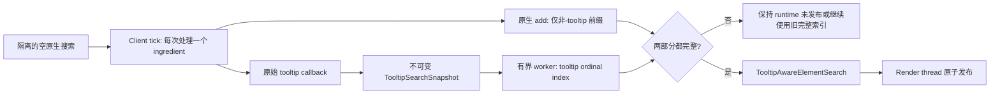

# JEI Tooltip 搜索优化设计

> Status: Phase 0/1/2 核心实现完成，进入验收；正式功能默认关闭，尚未达到默认开启门槛。
> Scope: JEI ingredient filter 中由 tooltip 派生的搜索字符串，不包含鼠标悬停时的 tooltip 绘制缓存。
> Reference: JEI-Async `1.20.1-async` 分支及其 issue #2。
> Implementation: 2026-09-17 开始分阶段实现；worker 不得调用 tooltip、renderer 或 ingredient helper。

## 实现进度 (2026-09-17)

### Phase 1/2 验收候选

已实现 `async.tooltipSearchIndex=false` 和 `syncOptimizations.tooltipStringCache=true`。
前者需要 `asyncStartup`、至少一个 ingredient-filter 开关、受控 GUI 注册作用域和匹配的
JEI ABI；低内存、禁用 tooltip 或不支持的 storage 保留完整原生路径。配置在启动时取快照，
变更需重启客户端，不在运行中卸载 Mixin。

实际完成协调：Render thread 在 JEI GUI 注册期间构造空 filter 并提交 client-tick 工作后
立即返回；专用启动线程在该 GUI 回调返回后等待 `JeiOptFilterBuildGate`，再继续插件回调。
最终 runtime 发布前再次检查完成门。Render thread 不等待 future，worker 不读取游戏对象。
完整 wrapper 安装、必要的资源重建和侧栏通知均在 client thread，之后才允许发送 runtime。

正式后台索引复用 JEI 的 stock 后缀树，只存字符串和整数 ordinal。旧版本使用
`GeneralizedSuffixTree`，现代版本使用 `GeneralizedSuffixTreeSearchStorage`，不是 Phase 0
的线性参考索引。公共 `MethodHandle` 在客户端按已验证签名解析一次，避免硬绑定变动的
`PrefixInfo` 包；不使用私有反射。通过 accessor 检查实际已经创建的 tooltip storage，
不会额外调用第三方 factory。Forge 与 NeoForge 的 `findElement` 返回值也分别适配。

构建每批最多 128 个元素，达到 262,144 个 UTF-16 字符或 1 MiB 估算字节时提前提交；
单个 callback 不可抢占，单个超大元素不截断。`TooltipSnapshotProducer` 提交后继续检查
既有 tick 预算，不再强制一批一 tick；共享 tick 队列的公平调度规则不变。
`TooltipIndexPipeline` 最多两批排队，加一批正在消费，活动加排队估算上限 3 MiB。
客户端另有最多一批组装/待提交数据；内存压力检查发生在 getter 前，未知长度的单元素
可能越界，完整保留直到可提交。超出队列字节上限的批次只在活动/排队为空时接收。
这些是快照估算，不是严格 heap 上限，也不包含最终索引、原生 delegate 或 wrapper。
同一 backend 只有一个 writer；空闲退出和新批调度共用锁，客户端从不等待 writer。
原生非-tooltip 索引与后台 tooltip 索引全部完成后才发布；运行时 `add` 在 capture scope
外继续由原生 delegate 处理，查询按 identity 合并。元素可见性仍由原生 filter 过滤。

缓存采用更保守的构建局部 ordinal key，估算权重上限 16 MiB，缓存合法空结果；超限只
停止新增缓存，不丢 ingredient 或 tooltip。它用于诊断/失败回退重放，正常首次提取没有
跨对象命中收益。不按 UID 合并对象，不跨 build/reload 复用，完成后释放。

失败时停止生产、清空未消费队列、请求 writer 合作取消，确认不再写入后才创建完整原生
结果；不能把 `CompletableFuture.cancel` 当作 writer 停止确认。缓存未命中重新调用原生 getter。
取消即时信号不捕获游戏对象，游戏对象和客户端组装快照在客户端清理；worker 仅持有纯
pipeline、不可变字符串快照与旧 backend，当前字符串写入结束后释放活动批次及 sink。
generation/level 失效取消，player/语言/资源/advanced-tooltip/mode 变化清缓存并原生回退。
资源变化后另调用 JEI 自己的 `rebuildItemFilter` 更新名称和排序，再刷新侧栏。已发布
filter 的 reload 继续 JEI 原生同步重建，不新增异步 rebuild 状态机。Forge 发布 JAR 的
资源重载方法 `m_6213_` 和开发名都经过精确 descriptor 门禁与真实 JAR 测试。

这两项属于相对原设计的收紧：不提供 generation 跨构建缓存，不异步优化 live reload。
它们避免了可变 ingredient 的 UID 别名和缺少可靠重载事件时的过期数据风险，见 CR-3。

| 验收项 | 已观察结果 | 证据标签 |
|---|---|---|
| Forge JEI 15.20.0.120 | 2670 元素；128 查询零差异；隔离 delegate 新增检查通过；发布先于 runtime 回调 | `forge-default.tooltip-index-release-candidate` |
| Forge JEI 15.48.0.179 | 2670 元素；128 查询零差异；缓存重放命中 2671 次（含新增探针）；约 947718 bytes 估算缓存 | `forge-15.48.0.179.tooltip-index-release-candidate` |
| NeoForge JEI 19.27.0.340 | 1688 元素；128 查询零差异；缓存重放命中 1689 次；约 462536 bytes 估算缓存 | `neoforge-default.tooltip-index-release-candidate` |
| 缓存关闭 | 128 查询对比通过；cacheHits=0、cacheBytes=0 | `forge-15.48.0.179.tooltip-index-cache-off` |
| 低内存模式 | JEI 正常进入世界，未创建 tooltip 索引 | `forge-15.48.0.179.tooltip-index-lowmem` |
| worker 首批抛错 | 完整原生回退到 2670 元素，之后才发布；临时故障探针已移除 | `forge-15.48.0.179.tooltip-index-failure-probe` |
| 无差分诊断 | 2670 元素分 26 tick 完成；clientAddMs=149、maxElementMs=13、maxTickMs=15、构建 wall=1060 ms | `forge-15.48.0.179.tooltip-index-production` |
| 正式功能和诊断都关闭 | JEI 正常启动，无 tooltip 构建/发布标记 | `forge-15.48.0.179.tooltip-index-off` |
| 单元/ABI | 双加载器各 5 个测试入口通过；原生后缀树 486 条对比；三份发布 JAR 前缀与 reload ABI 通过 | `tooltipTest` |

证据文件在 `build/benchmarks/jei-compat`，对应 `.latest.log` / `.debug.log` /
`.runtime.txt`。所有客户端样本都进入独立世界副本，不仅到主菜单；客户端由验收脚本退出。

无诊断开启样本 JEI start=3.509 s，关闭样本=2.741 s，不能声称总启动更快。新路径把工作
分帧并搬移纯索引计算，也引入队列等待；目标是降低连续停顿，需真实大包重复测量确认收益。
部分开启诊断样本的单次元素仍有 43-61 ms 长尾，预算不能抢占第三方 callback。

仍未通过的发布门槛：至少 5 次 A/B 的 heap/GC/查询 P95、完整语言/资源 reload 与第二世界
矩阵、真实运行期 ingredient 更新/移除、故障取消时的对象释放、JEI-Async 和自定义 storage
实机共存、复杂第三方 tooltip 包及生产混淆环境进世界验证。隔离 delegate 新增探针不等价于
真实插件动态更新验收；源码保护与单元取消测试也不等价于真实断连/重载压力测试。
因此当前是可测试的实现候选，不是默认开启的完成版本。

### 批次流水线验收补充 (2026-09-17)

本轮按“测量 -> 解除批次限速 -> 失败/取消 -> 验收”实施。没有修改 recipe 注册顺序、
第三方 tooltip 线程、查询 wrapper 合并算法或缓存默认值。未根据旧版日志推断新版本收益。

正式构建即使 `diagnostics.tooltipSearchMetrics=false` 也输出以下计数，不额外调用 getter：

- `getterCalls/getterMs/maxGetterMs`：实际 getter 的累计/最大 elapsed 时间，缓存重放不计；异常退出在 capture scope 收尾。
- `clientAddMs/maxElementMs`：所有受控 native add 调用，包含 getter 时间，不能与 getter 相加；`referenceAddMs` 是其中回退/诊断重建部分。
- `maxBuildStepMs`：本构建任务单次切片（包含最终同步发布回调），不是完整 Minecraft tick；最终切片日志之前的耗时已计入。
- `workerMs/batches/consumedBatches`：writer 累计 elapsed 时间及批次数；多线程池不意味着并行写索引。
- `peakQueuedBatches/peakPendingChars/peakPendingBytes`：排队峰值及包含客户端组装批次的估算高水位，不是精确 heap 峰值。
- `queueFullYields/waitingTicks/maxElementsPerTick/totalMs`：背压让出、无提取等待 tick、单 tick 提取峰值和构建 wall time。
- `JEI startup runtime timing`：从本项目 startup driver 开始到实际 runtime publication 返回；记录 epoch 毫秒，`sidebarInteractive=notMeasured`。
- `JEI startup client tick timing`：Minecraft tick HEAD 到本项目 TAIL hook（含队列 drain）的累计/最大时间；包含与启动重叠的首个完整 tick，不是帧间隔或 frame P95。

性能 A/B 必须关闭差分；getter 时间是 wall elapsed，并非线程 CPU 或 allocation 采样。
真正侧栏首帧/可交互时间、帧 P95、查询 P95、heap/GC 仍需外部采集，不能用 runtime
publication 时刻替代。16 MiB 上限仅用于缓存，不是整个功能的总内存上限。

| 本轮检查 | 结果 | 证据标签 |
|---|---|---|
| 实际 producer 合成测试 | 180159 轻量元素在充足预算下单次 pump 全部处理；停滞 writer 时两批256项后让出 | `TooltipPipelineTest` |
| 并发/结束/取消 | 20000批、4线程调度下单 writer；排空确认、空输入、超大元素、拒绝执行、故障、活动取消均通过 | `TooltipPipelineTest` |
| Forge JEI 15.59.0.212 | 2670项，128查询零差异；单tick最多256项；实际发布通过 | `forge-15.59.0.212.tooltip-pipeline` |
| NeoForge JEI 19.56.0.441 | NeoForge21.1.238 + MezzConfig0.5.6；1688项，128查询零差异；实际发布通过 | `neoforge-19.56.0.441.tooltip-pipeline-final` |
| Forge 无差分测量 | 2670 getter/2670项；referenceAddMs=0；17tick，单tick最多248项，构建607ms；add163ms/getter57ms/worker35ms | `forge-15.59.0.212.tooltip-pipeline-production` |
| Forge writer故障 | 提取233项后失败，完整2670项原生回退发布；getter总数2670，旧backend未发布；临时探针已删除 | `forge-15.59.0.212.tooltip-pipeline-failure` |
| 双加载器测试 | 各6个tooltip测试入口通过，包括实际后缀树486查询与确定性getter计时 | `tooltipTest` |
| 原版本线回归 | Forge15.20.0.120、Forge15.48.0.179、NeoForge19.27.0.340均通过正式tooltip差分与发布 | `forge-default` / `forge-15.48.0.179` / `neoforge-default` 的 `tooltip-pipeline-regression` |
| 最终打包 | 两节点 `build` 通过，含 `check`、6个tooltip测试入口及remap；存在可选版本目标的remap提示，生产混淆实机仍待验证 | `:1.20.1-forge:build :1.21.1-neoforge:build` |

19.56 的初次运行正常启动 JEI 但 tooltip 被门禁关闭，**不计通过**。本轮修正已验证的
MezzConfig `IConfigValue` 前缀、advanced-tooltip、low-memory 读取及 SearchMode 包名；
旧 getter 与新精确签名都有门禁，未放开任意自定义配置/storage。真实 JAR ABI 检查通过。
验收脚本现在遇到门禁关闭或 JEI 完成但未构建索引时立即失败，不再等到超时。

以上小实例不是五组交替 A/B，不能与此前不同 JEI 版本的单样本比较得出提速比例。
完整大包/同世界/同Java/同JEI的五组 A/B、侧栏交互与P95/heap/GC、退出和第二世界、
reload、动态ingredient更新/移除仍待验收。原始 getter 返回 Set，未盲目增加去重；
对象分配优化及 Vanilla/Create/TConstruct/Cyclic 具体热点补丁等待本轮大包采样后选择。

### Phase 0 历史验证

`diagnostics.tooltipSearchMetrics=false` 是诊断开关，不是性能优化开关。
开启需重启客户端，Mixin 在配置预读和 ABI 门禁通过后才应用。它观察原生 getter 的最终
字符串，复制为不可变 ordinal 快照，用有界 worker 任务构建精确子串参考索引，再在
client tick 中每次比较一个原生前缀查询。原生返回值、调用次数、搜索索引和 runtime
发布保持不变；单独开启此诊断时不会启用 capture suppression 或创建查询 wrapper。
与正式功能一起开启时，它会在发布前通过原生参考构建做差分；缓存不足或关闭时可能重跑
tooltip 回调，验收用诊断不应常开，也不能当作无开销计时器。

实机验证纠正了原设计的一个前提：当前 `PluginCallerMixin` 强制 GUI runtime 注册在
Render thread 执行，旧的 `isJeiStartThread()` 分帧分支并非默认启动的实际路径。
因此 Phase 0 同时观察 legacy `addAll` 和 modern `createElementSearch` 的原生调用，
不改变它们的调用顺序。Phase 0 诊断在完整原生构建后异步完成，不阻塞 runtime 发布。
Phase 2 现已通过上方描述的 GUI 注册完成门接通，不能在 Render thread 等待队列。

当前诊断上限为 4,096 个元素、16,384 个原始字符串及 1,000,000 个 UTF-16 字符；
pending chunk 上限为 `max(2, workerThreads * 2)`。超过上限停止整个诊断，不抽样遗漏
ingredient，也不删除任何 JEI 内容。临时快照/索引在完成、失败或 stop 时释放；worker
通过纯取消 token 停止。该参考索引使用精确线性字符串匹配，仅用于差分，不适合直接
作为生产查询 backend。当前没有 generation reuse cache、UID 缓存或磁盘缓存。

| 实机路径 | 捕获元素 | 空结果 | 唯一字符串 | 查询对比 | 结果 |
|---|---:|---:|---:|---:|---|
| Forge / JEI 15.20.0.120 | 2670 | 204 | 1633 | 64 | 零差异；`#`，不 trim |
| Forge / JEI 15.48.0.179 | 2670 | 204 | 1633 | 64 | 零差异；`$`，trim |
| NeoForge / JEI 19.27.0.340 | 1688 | 133 | 789 | 64 | 零差异；`$`，不 trim |
| Forge / JEI 15.48.0.179，诊断关闭 | 0 | 0 | 0 | 0 | JEI 正常启动，无 shadow 日志 |

以上均进入独立测试世界，不仅停留主菜单。最后一次现代 Forge 开启诊断的 JEI start 为
3.239 s，关闭样本为 2.677 s；这是单次正确性验收，不能用来声称性能收益。`clientAddMs`
包含整个原生 add/factory 耗时，`mergeQueryMs` 仅包含 worker 合并和参考查询，不是 tooltip
回调专用计时，也不包含各 chunk 的 build 时间。

证据在工作区 `build/benchmarks/jei-compat` 中，以 `tooltip-shadow-isolated`、
`tooltip-shadow-final`、`tooltip-shadow-off` 为标签。最早共享 run 目录的
`tooltip-shadow` 样本未进入捕获路径，不计为通过。

可重复的单元/ABI 检查：

```powershell
.\gradlew.bat :1.20.1-forge:tooltipTest :1.21.1-neoforge:tooltipTest --offline
.\scripts\test-tooltip-shadow.ps1
```

Gradle 任务包含捕获恢复、线程隔离、空结果、Unicode/随机子串、取消 token、segment
合并和前缀 ABI 拒绝测试；可用 `-PtooltipTest.jars=<path;path>` 只读核对真实发布 JAR。
实机脚本的 `-RunDirectory` 指定工作区内独立目录，`-RequireTooltipShadow` 要求出现
真实 shadow 通过标记，须事先准备该目录的世界副本和开启诊断的配置。

Phase 0 的历史结论由上方 Phase 1/2 验收状态补充；64 条 shadow 查询本身不能授权默认开启。

## 1. 决策摘要

采用以下首期方案：

1. Tooltip 字符串只在 Minecraft client/render thread 上提取，并复用现有 client-tick 时间预算。
2. 提取结果立即复制成只含序号和字符串的不可变 `TooltipSearchSnapshot`。
3. Worker 只规范化字符串并构建以 ingredient 序号为值的只读 tooltip 索引。
4. 原生 JEI 搜索在隔离对象中继续构建其他前缀；初始 tooltip 字符串不写入该原生索引，避免重复建索引。
5. 原生非-tooltip 索引和完整 tooltip 索引都就绪后，才组合成一个 `IElementSearch` 并原子发布。
6. 首次启动和 rebuild 都不得暴露逐条增长的 tooltip 搜索结果。初次启动保持 runtime 未发布；rebuild 保持旧的完整索引可用。
7. 缓存只在当前 generation/context 内有效，不落盘，不跨世界、服务器或 JEI runtime。
8. ABI、自定义搜索存储或 JEI-Async 共存检查不通过时，保留当前原生 client-tick 构建路径。

最重要的线程红线：

> 不得从 `JEI Plugin Loader`、`justenoughthreads-start`、ForkJoinPool 或普通 worker 调用
> `IListElementInfo.getTooltipStrings`、`IIngredientRenderer.getTooltip`、
> `ItemStack.getTooltipLines` 或等价第三方 tooltip 路径。

本方案主要降低连续主线程停顿，并把纯索引 CPU 移到 worker。由于禁止跨启动磁盘缓存，第一次构建仍须实际执行每个未命中 ingredient 的 tooltip 回调；不能宣称消除了这部分总 CPU 成本。

## 2. 当前项目锚点

当前实现已经提供了本方案需要的外层生命周期：

- `AsyncIngredientFilterBuilder` 在 client tick 内逐元素调用 JEI `IElementSearch.add`，每个元素后检查预算。
- `IngredientFilterMixin` 覆盖旧版 JEI 的逐项构造路径。
- `IngredientFilterModernMixin` 拦截新版 JEI 的 `createElementSearch`，先创建隔离的空搜索对象。
- `JeiOptFilterBootstrap` 在新版构造 redirect 与 RETURN 回调之间传递构建参数。
- `JeiOptRuntimeState` 提供 generation、取消和旧结果丢弃。
- `JeiOptCacheScope` 提供一次 start 内的缓存生命周期。
- 完整的隔离索引只在构建结束后替换到 `IngredientFilter.elementSearch`；JEI runtime 随后在 render thread 发布。

Tooltip 优化必须扩展这条路径，不能创建第二套独立启动流程。

## 3. JEI-Async 参考结论

### 3.1 可借鉴机制

JEI-Async 当前实现包含以下做法：

- `ElementSearch` 在后台构建时跳过未缓存的 tooltip，并记录 `DeferredTooltip(info, uid)`。
- `processDeferredTooltips` 检测调用线程；若不在 render thread，则通过 `Minecraft.execute` 重新调度。
- `SearchStringCache` 以 ingredient UID 和 prefix 保存字符串，并显式记录空结果，避免下次把空值误判为未命中。
- 初始 baked substring index 完成后，延迟 tooltip 被写入可变 overflow tree。
- 缓存完成后异步写入 gzip JSON，并释放内存副本。

这些事实证明了两个有价值的模式：

1. tooltip 提取和纯字符串索引构建应分离；
2. “空 tooltip 搜索字符串”也是一个有效缓存结果。

### 3.2 不照搬的部分

| JEI-Async 行为 | 本项目选择 | 原因 |
|---|---|---|
| 持久化 `search_string_cache.json.gz` | 不采用 | 已冻结契约禁止磁盘和跨世界缓存。 |
| 全局 cache key 只包含排序后的 ingredient UID 与 locale | 不采用 | 未覆盖 advanced tooltip、资源/数据包、服务器、玩家/level 上下文和搜索配置。 |
| 初始索引发布后逐条写 tooltip overflow | 首期不采用 | 用户会在同一查询中观察到结果逐渐增加，违反完整结果发布契约。 |
| 直接让 built storage 接受运行时写入 | 仅保留 JEI 原生运行时 add 路径 | 自定义 search storage 可能有不同线程和可变性要求。 |
| 后台构建期间调用 tooltip | 严格禁止 | JEI-Async issue #2 已出现跨线程访问 Render Thread RNG/客户端状态的崩溃。 |

### 3.3 参考源码

- [JEI-Async repository](https://github.com/Mysticpasta1/JEI-Async)
- [ElementSearch](https://github.com/Mysticpasta1/JEI-Async/blob/1.20.1-async/Gui/src/main/java/mezz/jei/gui/search/ElementSearch.java)
- [SearchStringCache](https://github.com/Mysticpasta1/JEI-Async/blob/1.20.1-async/Gui/src/main/java/mezz/jei/gui/search/SearchStringCache.java)
- [Tooltip thread failure, issue #2](https://github.com/Mysticpasta1/JEI-Async/issues/2)
- [Upstream merge preserving tooltip deferral and overflow indexing](https://github.com/Mysticpasta1/JEI-Async/commit/637509e9896a9f01cbad18f148d0526a59071470)

## 4. Goals 与 Non-goals

### Goals

- 保持 tooltip 搜索结果与同版本 JEI baseline 完全一致。
- 将 tooltip callback 分散到多个 client tick，避免一次长时间连续阻塞。
- 将 substring/suffix/baked index 的纯计算移到 worker。
- 同一个 build/context 中不重复提取相同 ingredient 的 tooltip 字符串。
- 兼容空结果、重复字符串、异常 ingredient、运行时 ingredient add 和搜索模式切换。
- 在退出世界、切服、reload 或新 generation 后保证旧任务无法发布。
- 每个行为都可关闭，并在 ABI 未知时 fail-soft 到现有路径。

### Non-goals

- 不缓存或加速实际悬停 tooltip 的绘制。
- 不在 worker 执行第三方 tooltip/event bus/player/level/renderer 逻辑。
- 不修改或并行执行 JEI plugin 回调。
- 不持久化 tooltip 字符串，不跨启动复用。
- 不通过关闭 tooltip 搜索、丢弃字符串或限制 ingredient 数量换性能。
- 首期不提供用户可见的“部分 tooltip 索引”。

## 5. 线程所有权

| 操作 | Client/render thread | JEI startup thread | Worker |
|---|---:|---:|---:|
| 读取 `Minecraft`、player、level、language | 是 | 否 | 否 |
| 调用 `getTooltipStrings` / renderer / `ItemStack` tooltip | 是 | 否 | 否 |
| 计算 ingredient type UID / ingredient UID | 是 | 否 | 否 |
| 更新 hidden state | 是 | 否 | 否 |
| 构建 JEI 原生非-tooltip 索引 | 是，按 tick 分片 | 否 | 否 |
| 复制 `List<String>` 为不可变值 | 是 | 否 | 否 |
| trim、去重、字符串索引构建 | 可 | 否 | 是 |
| 处理 `(ordinal, immutable strings)` | 可 | 否 | 是 |
| 持有或调用 `IListElement`、`IListElementInfo` | 是 | 仅隔离对象协调 | 否 |
| 替换 live `elementSearch` / 发布 runtime | 是 | 仅等待完成门 | 否 |

线程判断使用 `Minecraft.isSameThread()` 或已验证的 client-tick 调度点，不使用线程名称作为安全条件。

单个第三方 tooltip callback 无法抢占。如果一个 callback 本身超过预算，允许该 tick 超出预算一次；队列必须在该元素结束后立即让出，而不是继续处理下一元素。

## 6. 推荐架构



### 6.1 Build 请求

每次构建创建一个不可变 `TooltipBuildContext`。它至少记录：

- generation；
- 本次 filter build 的唯一 build id；
- 当前 language code；
- JEI `searchAdvancedTooltips` 值；
- tooltip search mode；
- resource/data reload revision；
- 当前 world/connection revision；
- 已选中的 JEI ABI/backend id。

构建开始前必须确认：

- 全局、ingredient filter 和 tooltip 专用 feature gate 均开启；
- 不处于 JEI low-memory search；
- tooltip 搜索未禁用；
- ABI 和搜索 backend 已通过完整门禁；
- 未检测到 JEI-Async 自带的 tooltip deferral。

任一条件不满足，直接调用现有 `AsyncIngredientFilterBuilder`，不得留下 capture scope 或 worker 任务。

### 6.2 Client-thread 提取与原生 add

推荐使用一个严格作用域化的 `TooltipCaptureContext`：

1. `AsyncIngredientFilterBuilder` 处理元素前设置当前 ordinal、cache key 和 snapshot sink。
2. 在 `try/finally` 内调用原有 `elementAppender.add(search, info)`。
3. `ListElementInfo.getTooltipStrings` Mixin 在 HEAD 检查 cache hit：命中时把缓存值送入 sink，并让原生调用看到空集合。
4. 未命中时执行 JEI 原方法；RETURN 处复制其最终返回值、记录 cache/snapshot，并让原生调用看到空集合。
5. `finally` 必须移除 ThreadLocal，即使第三方 tooltip 抛出异常。

这里捕获的是 JEI 已完成格式移除、名称/mod id 去重等处理后的最终搜索字符串。项目代码不得重新实现第三方 tooltip 生成逻辑。

只在“隔离索引的初始构建”作用域内抑制 tooltip。正常悬停、运行时 ingredient add、baseline/fallback 构建及其他调用必须看到原返回值。

### 6.3 Snapshot

建议新增独立 DTO，不修改已冻结的 `IngredientSearchSnapshot`：

```java
public record TooltipSearchSnapshot(
    int elementOrdinal,
    List<String> tooltipStrings
) {}
```

约束：

- `elementOrdinal` 只在当前 build 中有意义。
- `tooltipStrings` 使用 `List.copyOf`，不得包含 component、renderer、ingredient 或 `ItemStack`。
- 空列表是成功值，不是 cache miss。
- Worker 不接收 `IListElement<?>[]`；该映射由最终 wrapper 在发布线程持有。

### 6.4 Worker 索引

Worker 输入只包含不可变 `TooltipSearchSnapshot` chunk 与纯索引 backend。正式实现使用
同一后缀树上的单 writer 顺序消费，而非并行构建/合并 segment。

必须有背压：正式队列最多两批排队，活动加排队3MiB估算字节，具体超大元素与客户端组装
约束见上方实现进度。达到上限立即让出，不阻塞、不丢批。Phase 0独立诊断仍保留自己的上限。

索引值使用 primitive ordinal，不把 `IListElement` 传给 worker。首选 backend 顺序：

1. 对已验证的 stock JEI storage，使用整数值构建与该版本相同语义的 substring index。
2. 项目自有的精确 reference backend 可用于差分测试和小集合 fallback。
3. 检测到第三方自定义 search storage factory 或未知 backend 时，关闭本优化并走原生路径；不得在 worker 调用第三方 factory。

若实现项目自有 backend，它必须保存完整规范化字符串并在返回前做 `contains` 复核。N-gram 只能筛选候选，不能直接决定结果。空白处理、大小写、locale 和短 token 行为必须由目标 JEI 的 golden tests 冻结。

### 6.5 查询包装器

最终发布对象建议为 `TooltipAwareElementSearch implements IElementSearch`：

- `findElement`、`getAllIngredients`、`clear`、统计和非-tooltip 查询委托给原生隔离搜索。
- tooltip 查询先取得原生结果，再 union 完整 tooltip ordinal index 的结果。
- 原生结果不能省略，因为 runtime ingredient add 在 capture scope 外仍由 JEI 正常写入原生 tooltip storage。
- no-prefix 查询仅在当前 tooltip `SearchMode` 会参与无前缀搜索时 union tooltip index。
- 返回值继续使用 ingredient identity 语义去重。

不得跨版本硬编码 tooltip prefix 字符。实现应从该次 `ElementPrefixParser` 的 `PrefixInfo` 捕获 tooltip searchable，并按对象身份和 mode 路由。不同 JEI 分支曾使用不同 prefix 文档或实现，字符只能作为诊断信息。

### 6.6 完整发布

完成条件是：

- 所有元素的 hidden state 和原生非-tooltip add 完成；
- 每个启用 tooltip 的元素都产生了 `SUCCESS` 或 `EMPTY` snapshot；
- 所有 worker segment 完成并合并；
- backend 自检通过；
- generation 和 build id 仍是当前值。

满足后才创建 wrapper。初始 JEI start 中，wrapper 先挂到尚未发布的 filter，随后沿现有 render-thread runtime 发布门一次性可见。Live rebuild 中，旧完整 wrapper 保持可用，新的完整 wrapper 在 render thread 一次替换并只失效 sidebar cache 一次。

## 7. Cache 设计

### 7.1 两级生命周期

- Build-local handoff cache：必需。用于区分 miss/empty、向 worker 交接，并支持失败后的原生重建；索引发布后立即释放。
- Generation-local reuse cache：可选，受 `syncOptimizations.cacheScope` 和 tooltip 专用 gate 控制。仅在 context 完全相同时复用，并设置容量/字节上限；超限后停止新增，不驱逐正在构建的数据。

不要直接把 tooltip 值塞入当前通用 `JeiOptCacheScope.STRINGS`。专用 cache 需要表示 `MISS`、`EMPTY`、`SUCCESS` 和 context，使用通用 `Map<Object,Object>` 容易把空值或旧上下文误判为命中。

### 7.2 推荐 key

```java
record TooltipIngredientKey(String ingredientTypeUid, String ingredientUid) {}

record TooltipExtractionContext(
    long generation,
    long resourceRevision,
    long dataRevision,
    long connectionRevision,
    String languageCode,
    boolean advancedTooltips
) {}

record TooltipCacheKey(
    TooltipExtractionContext context,
    TooltipIngredientKey ingredient
) {}
```

UID 必须在 client thread 通过当前 JEI helper 和 `UidContext.Ingredient` 获取，并可复用现有 generation-local UID cache。不能以可变 `ItemStack` 本体的 `equals/hashCode` 作为长期 key。

Tooltip search mode 属于 build/query fingerprint，而不是字符串内容 key。仅从 `REQUIRE_PREFIX` 切到无前缀参与模式时可以复用同一批字符串，但必须重建或重新组合查询索引。

### 7.3 空值和失败

- `EMPTY`：原始 JEI 方法成功返回空集合，必须缓存。
- `SUCCESS`：保存不可变副本；是否保留重复项应与目标 JEI 返回语义一致。
- 未捕获异常：不写 `EMPTY`。标记当前优化 build 失败并进入 fallback。
- JEI 自己捕获异常后返回空集合：按 baseline 语义记录 `EMPTY`，不得擅自改变。

### 7.4 失效矩阵

| 事件 | In-flight build | Build cache | Generation reuse cache | Published index |
|---|---|---|---|---|
| JEI start | 新建 | 新建 | 新建 | 尚无 |
| JEI stop / logout / world replacement | 取消 | 清空 | 清空 | 丢弃 |
| 切换服务器 | 取消旧 generation | 清空 | 清空 | 新 runtime 重建 |
| resource pack / language reload | 取消或使 build id 失效 | 清空 | 清空 | 保留旧完整值直到新值原子替换 |
| data pack / tag / recipe sync | 取消旧 generation | 清空 | 清空 | 新 runtime 重建 |
| `searchAdvancedTooltips` 改变 | 取消当前 tooltip build | 清空 | context miss/清空 | 完整重建 |
| tooltip search mode 改变 | 取消当前组合 | 字符串可复用 | 字符串可复用 | 重新构建 query policy/index |
| runtime ingredient add | 不影响 base build | 新元素单独处理 | 按 key 新增或跳过 | 由原生 `add` 原子加入 |
| 同 UID ingredient 被替换/更新 | 当前 build 失效或单 key 清除 | 清除该 key | 清除该 key | 走 JEI rebuild/add 语义 |
| 玩家短暂状态变化 | 不主动重建 | 不变 | 不变 | 与 JEI baseline 的构建时快照语义一致 |
| `general.enabled=false` 或 feature 关闭 | 取消 | 清空 | 清空 | 下次走 baseline；不得留下半启用 wrapper |

若目标 JEI 的 reload 生命周期没有触发 `JeiOptRuntimeState.beginStart/invalidate`，实现前必须增加独立 `resourceRevision`，不能假设 generation 自动覆盖所有 reload。

## 8. 状态、取消与失败回退

建议状态机：

```text
NOT_STARTED -> CAPTURING -> BUILDING -> READY_TO_PUBLISH -> PUBLISHED
                    |           |              |
                    +-----------+--------------+-> FAILED -> NATIVE_FALLBACK
                    +---------------------------> CANCELLED
```

规则：

- 每个 client-tick step、worker chunk、merge 和 publish 都检查 generation/build id。
- 新 build 取消同 filter 的旧 build；旧任务完成也只能丢弃。
- `stop()` 同时清理 client queue、worker futures、capture ThreadLocal 和 cache。
- Capture 次数与预期启用元素数不一致时视为 ABI/控制流失败，不能发布缺 tooltip 的 wrapper。
- Worker 或 semantic self-check 失败时丢弃整个新索引，不能把空 tooltip index 当成功。
- 初始 start 的 fallback 重新创建隔离的原生搜索并按现有预算构建；live rebuild 则继续服务旧索引直到 fallback 完成。
- Fallback 期间 capture suppression 必须关闭。可用已捕获字符串做安全 replay，但首版允许重新走原生方法，以简单和正确为先。
- 同一 generation 同一失败原因只记录一次 WARN；计数和首个堆栈写入诊断摘要。

## 9. ABI 与共存门禁

Tooltip 优化应作为一个 atomic feature：任一必要 Mixin/成员不兼容时，整项关闭。

实现前至少验证：

1. 当前 JEI 版本选中的 legacy/modern `IngredientFilter` 路径。
2. `ListElementInfo.getTooltipStrings` 的完整 descriptor、返回类型和异常语义。
3. 隔离构建使用的 `ElementSearch.add` 对每个启用元素恰好经过一次 tooltip getter。
4. `IElementSearch` 所有方法与 wrapper 的 descriptor。
5. `ElementPrefixParser` 能可靠取得 tooltip `PrefixInfo`、no-prefix 对象和 `SearchMode`。
6. stock search backend 可用整数 ordinal 构建，并且只接触纯字符串/primitive。
7. runtime `add` 的原生 tooltip storage 在初始空建后仍可写入。
8. low-memory search 和第三方 advanced search factory 的检测方式。

目标矩阵至少包括：

- Forge 1.20.1 / JEI 15.20.x legacy；
- Forge 1.20.1 / JEI 15.48-15.57 modern；
- NeoForge 1.21.1 / JEI 19.27.x；
- JEI-Async `1.20.1-async`。

### JEI-Async 共存

JEI-Async 仍使用 mod id `jei`，不能只按 mod id 判断。`JeiOptMixinPlugin` 应通过 bytecode 检查
`ElementSearch.processDeferredTooltips`、`SearchStringCache` 构造/字段或等价的完整行为标记。
检测到其自带 deferral 时：

- 仅关闭本项目 tooltip capture/suppression/index wrapper；
- 不删除或修改 JEI-Async 的缓存文件；
- 不再次调度 `processDeferredTooltips`；
- INFO 一次说明由 JEI-Async 接管；
- 其他已验证的 Just Enough Threads 功能按各自门禁决定是否启用。

### 自定义 search storage

如果 JEI plugin 替换了 search storage factory，本项目不得把该 factory 调到 worker，也不得用
项目自有 substring 语义静默覆盖它。首期直接关闭 tooltip worker index，保留当前原生
client-tick 路径。后续若要支持，必须为具体 factory 增加显式兼容适配和差分测试。

## 10. 配置草案

以下仅是后续实现提案。现有配置契约规定新增 key/default 需要 CR，并同步更新
`JeiOptConfig`、`JeiOptConfigSnapshot`、`JeiOptFeatureFlags` 和文档。

| Key | 初始默认 | 作用 |
|---|---:|---|
| `async.tooltipSearchIndex` | `false` | 开启 client-thread capture + worker ordinal index + 完整发布。通过全矩阵后再评估默认开启。 |
| `syncOptimizations.tooltipStringCache` | `true` | 允许同 generation、同 context 的 tooltip 字符串复用；仍受 `cacheScope` 控制。 |
| `diagnostics.tooltipSearchMetrics` | `false` | 输出 capture、cache、worker、fallback 和查询延迟摘要。 |

不新增独立预算或线程数：

- client 提取复用 `async.ingredientFilterBudgetMs`；
- 进度粒度复用 `async.ingredientFilterChunkSize`；
- worker 复用 `async.workerThreads` 和 `async.parallelThreshold`。

低内存模式、`general.enabled=false`、`async.asyncIngredientFilter=false` 或
`async.tooltipSearchIndex=false` 时，tooltip worker index 必须完全不创建。

## 11. 诊断指标

以下为完整测量目标；已实现且不依赖差分开关的字段见上方批次流水线补充。
P50/P95/P99、allocation和真实侧栏交互时间尚未实现，不能视为已验收：

- generation、build id、JEI ABI/backend id；
- ingredient 总数、tooltip enabled 数；
- cache hit、miss、empty、失败数；
- client-thread tooltip callback 累计时间、P50/P95/P99/max；
- 每 tick capture 时间、超预算次数和最大单 callback 时间；
- snapshot chunk 数、最大 in-flight chunk 数、背压次数；
- worker build/merge 时间；
- 原生非-tooltip build 时间；
- publish 时间与发布线程；
- 原始/去重后字符串数、索引 retained bytes 估算；
- fallback 原因和次数；
- tooltip 查询 P50/P95、短 token 扫描次数；
- stale/cancelled task 数。

日志不得打印完整 tooltip 文本、NBT、服务器地址或玩家数据。

## 12. 验证方案

### 12.1 单元与差分测试

- Cache 能区分 miss、empty 和 success。
- context 任一字段变化都会 miss；search mode 仅触发 query policy 重建。
- capture scope 在正常、异常、嵌套调用后都恢复。
- worker 输入对象图中不存在 `IListElement`、`IListElementInfo`、renderer、helper 或 `ItemStack`。
- 空白、重复、大小写、Unicode、1/2 字符 token 和长 token 与目标 JEI storage 一致。
- ordinal 结果映射后保持 identity 去重。
- explicit tooltip、no-prefix enabled、require-prefix 和 disabled mode 一致。
- runtime add 的结果来自原生 delegate，并与 base ordinal 结果正确 union。
- worker/capture 失败不能产生权威空结果。
- generation 变化后旧 future 永不发布。

建议先实现 shadow mode：不抑制原生 tooltip index，同时捕获并构建 worker index；对固定和随机
token 比较两者的 ingredient UID 集合。只有三条 JEI 版本线都零差异，才启用 suppression。

### 12.2 游戏内功能矩阵

在同一 modpack、world、JEI 配置下分别采集 baseline 和 optimized：

| 场景 | 必须验证 |
|---|---|
| 普通 item tooltip 查询 | 结果 UID 集合、顺序与 baseline 一致。 |
| 附魔书、药水、自定义 NBT item | subtype 和 tooltip 词命中一致。 |
| 自定义 ingredient renderer | 无漏项、无重复、无额外 callback。 |
| `searchAdvancedTooltips=false/true` | 两种模式各自与 baseline 一致。 |
| tooltip `REQUIRE_PREFIX` / 无前缀参与 / `DISABLED` | prefix 和 no-prefix 路由一致。 |
| `en_us` / `zh_cn` 切换 | reload 后不复用旧语言字符串。 |
| resource reload | 旧完整索引持续可用，新索引一次替换。 |
| 退出世界、进入第二世界、切服务器 | 无旧 generation 搜索结果。 |
| runtime ingredient add | 新 ingredient 的 tooltip 搜索立即按 JEI 原语义出现。 |
| tooltip callback 访问 player/level/event bus/RNG | 所有调用都在 Render/client thread。 |
| tooltip callback 抛错或返回空 | 与 JEI baseline 的错误/空结果一致。 |
| low-memory mode | 本优化未创建任何 index/cache。 |
| JEI-Async 同时存在 | 本功能禁用，无双重 deferral 或重复字符串。 |

线程安全样本应包含曾在异步 tooltip 中触发 Render Thread RNG/thread check 的模组路径，以及
Apothic/Apotheosis 类属性 tooltip、复杂 capability tooltip 和自定义 event-bus tooltip。

### 12.3 “无 partial result”探针

准备一个只能通过 tooltip 唯一词命中的 ingredient，在构建期间每 tick 查询该词：

- 初次启动：runtime 未发布前查询入口不可用；发布后的第一次查询必须立即返回完整集合。
- rebuild：切换前持续返回旧完整集合；原子切换后返回新完整集合。
- 不允许出现 `0 -> 1 -> 2 ...` 的逐条增长过程。
- 取消/reload 后旧 build 的查询集合不得再次出现。

### 12.4 性能与内存

至少比较 5 次 feature-off 与 5 次 feature-on，记录：

- JEI start wall time；
- tooltip callback 累计 CPU 和最大单次耗时；
- client tick P50/P95/P99/max；
- worker build 时间；
- tooltip 查询 P50/P95；
- peak heap、发布后 retained heap、GC 次数与 pause；
- snapshot/cache/index 字符串数与估算字节。

建议接受门槛：

- 零 worker/off-thread tooltip callback；
- baseline/optimized 查询 UID 集合零差异；
- 零 partial publication；
- 除不可抢占的最大单 callback 外，capture tick 不持续超过配置预算；
- tooltip 查询 P95 不比 baseline 退化超过 10%；
- 发布后 retained heap 不高于 baseline 的 `max(5%, 64 MiB)`；
- peak heap 不高于 baseline 的 `max(15%, 128 MiB)`。

若内存门槛失败，优先关闭 generation reuse cache、缩短 snapshot 生命周期或改进 primitive
postings；不能用丢 tooltip 字符串换取通过。

## 13. 实现阶段建议

### Phase 0: ABI 与 shadow probe

- 增加只读 bytecode gate 和线程断言。
- Capture 但不抑制原生结果。
- 构建 ordinal index，与原生 tooltip 查询做差分。
- 配置默认关闭，不改变生产行为。

### Phase 1: Cache-only

- 实现专用 context key、empty caching 和 lifecycle 清理。
- 仍由原生 `ElementSearch.add` 建完整索引。
- 验证重复调用下降、内存上限和所有失效事件。

### Phase 2: Worker index + 原子发布

- Capture scope 对初始隔离 build 抑制原生 tooltip insertion。
- Chunk/背压/worker segment 构建。
- 发布 `TooltipAwareElementSearch`。
- 保持 feature 默认关闭，完成三条 JEI 版本线的差分与游戏内矩阵。

### Phase 3: 默认启用评审

- 达到 §12 所有硬门槛后提交 CR，决定是否默认开启。
- 评审日志噪声、整合包兼容性、heap 和查询延迟。

### Optional Phase 4: 延迟/overflow

JEI-Async 风格的 mutable overflow 只可作为后续实验，默认关闭。即使采用，也必须在不可见的
新 index 后构建，并在全部 tooltip 完成后一次切换；不能让 live 搜索逐条增长。运行时新增
ingredient 继续优先使用 JEI 原生 mutable storage。

## 14. 预计文件改动面

后续实现对话应优先保持改动集中：

- `snapshot/TooltipSearchSnapshot.java`
- `index/TooltipSearchIndex.java`
- `index/TooltipAwareElementSearch.java`
- `runtime/JeiOptTooltipCache.java`
- `runtime/TooltipCaptureContext.java`
- `mixin/ListElementInfoTooltipCaptureMixin.java`，必要时按 ABI 拆分 variant
- `index/AsyncIngredientFilterBuilder.java`
- `mixin/IngredientFilterMixin.java`
- `mixin/IngredientFilterModernMixin.java`
- `runtime/JeiOptFilterBootstrap.java`
- `JeiOptMixinPlugin.java`
- `JeiOptConfig.java`、`JeiOptConfigSnapshot.java`、`JeiOptFeatureFlags.java`
- `justenoughthreads.mixins.json`
- 对应 unit/differential/game-test 与验证文档

不得顺手修改 tooltip 绘制、recipe tooltip、bookmark tooltip 或第三方兼容代码。

## 15. 完成定义

只有同时满足以下条件，功能才可称为完成：

1. 所有 tooltip callback 均有线程证据证明在 client/render thread。
2. 三条支持的 JEI 版本线中，baseline/optimized tooltip 字符串和查询 UID 集合完全一致。
3. initial start、reload、切世界和取消场景均没有 partial/stale publication。
4. Feature-off、low-memory、unknown ABI、自定义 search storage 和 JEI-Async 共存均可靠回退。
5. 空结果被正确缓存，失败不被伪装成空结果。
6. Heap、GC、tick 和查询延迟达到 §12.4 门槛。
7. 文档、配置 CR、ABI target 表和验证证据同步完成。

在这些条件达成前，`async.tooltipSearchIndex` 保持默认关闭。